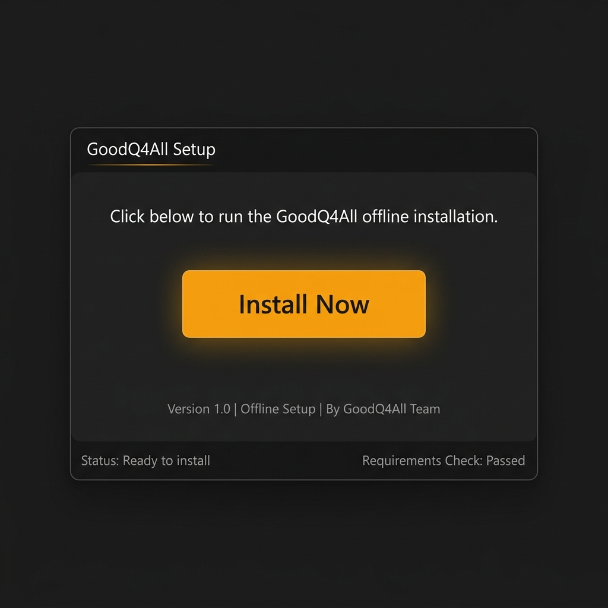

<!-- DOC_BADGE: CANONICAL -->
<!-- DOC_STATUS: AUTHORITATIVE -->
<!-- DOC_LAST_VERIFIED: 2026-05-29 -->

<p align="center">
  
</p>

# GoodQ4All

<p align="center">
  <a href="https://GoodQ02.github.io/goodq4all/">
    
  </a>
  <br />
  <sub style="color: #a39cb0;">(Note: The optional Ask GoodQ voice agent is a hosted extension using ElevenLabs APIs. The core GoodQ4All memory system itself is 100% local and offline.)</sub>
</p>

<p align="center">
  <a href="https://GoodQ02.github.io/goodq4all/"></a>
  <a href="https://github.com/GoodQ02/goodq4all/actions/workflows/ci.yml"></a>
  <a href="https://github.com/GoodQ02/goodq4all/actions/workflows/doc-drift-lint.yml"></a>
  <a href="https://github.com/GoodQ02/goodq4all/actions/workflows/codeql.yml"></a>
  <a href="https://github.com/GoodQ02/goodq4all/actions/workflows/dependency-review.yml"></a>
</p>

GoodQ4All is a local-first multimodal memory system for long-running video, audio, and text intelligence. It ingests media into scene-level memory, persists what it learns locally, and keeps the proof path visible. The system is built around deterministic Windows-first execution, with CPU-safe baseline behavior and optional GPU / WSL2 acceleration when you want more throughput.

GoodQ4All's thesis is simple: machine memory should earn every claim it makes.

> [!TIP]
> **Have questions? Ask GoodQ!** Try our interactive conversational voice agent at the [GoodQ4All Landing Page](https://GoodQ02.github.io/goodq4all/) to speak with a virtual Q-Branch operator trained on this repository.


---

*Get this:*
<p align="center">
  <video src="https://github.com/GoodQ02/goodq4all/raw/main/samples/assets/ui_onboarding_walkthrough.mp4" width="850" autoplay loop muted playsinline style="max-width: 100%; border-radius: 8px; box-shadow: 0 4px 20px rgba(0,0,0,0.3);"></video>
</p>

*From this:*
<table width="100%" border="0" cellspacing="0" cellpadding="10">
  <tr>
    <td align="center" width="50%" style="border: none;">
      <br />
      <small><em>Apollo 11 Moon Walk (nasa_descent.gif)</em></small>
    </td>
    <td align="center" width="50%" style="border: none;">
      <br />
      <small><em>Saturn V Launch (nasa_launch.gif)</em></small>
    </td>
  </tr>
</table>

*Using this:*
<p align="center">
  <a href="https://github.com/GoodQ02/goodq4all/releases/download/v1.0.0/GoodQ4All_Setup_1.0.0.exe" style="display: inline-block; padding: 16px 32px; background-color: #ffb300; color: #110d1a; font-size: 1.1em; font-weight: bold; text-decoration: none; border-radius: 6px; box-shadow: 0 4px 15px rgba(255, 179, 0, 0.4); transition: all 0.2s ease; margin: 10px 0;">
    🚀 Download GoodQ4All Setup v1.0.0.exe
  </a>
</p>

> [!IMPORTANT]
> **Supported Host: Windows 11 only.** GoodQ4All is built for Windows-first local execution (CPU-safe baseline by default; GPU and WSL2 are optional). Other platforms are not first-run targets today.

<p align="center">
  <a href="https://github.com/GoodQ02/goodq4all/releases/download/v1.0.0/GoodQ4All_Setup_1.0.0.exe">
    
  </a>
</p>

---

## The Local-First Intelligence Edge

GoodQ4All is a **100% local, zero-dependency, private offline alternative** to major cloud-based media intelligence services. By packaging the isolated Python runtime, Qdrant database, and perception libraries into a single sandboxed executable, we have made private video search and knowledge graph memory as easy to install as any desktop application. No cloud dependencies, no subscription fees, and no data leaks.

### Bypassing Cloud & Restoring Transparency
- **Zero External API Calls**: All models—including transcription (faster-whisper), face detection, image captioning, and local LLMs (vLLM/Ollama)—run locally.
- **Auditable Proof Trail**: The ingestion system preserves step-by-step logs (`step_runs.jsonl`), scene manifests, and intermediate features. If a step fails, the system shows you exactly why and where, instead of hiding behind a generic network error.
- **Offline Readiness**: The local API serves complete interactive documentation (`/docs` and `/redoc`) from static offline caches, ensuring total functionality even when completely disconnected.

---

## Before You Start

GoodQ4All requires Windows 11. The default runtime is local and CPU-safe. Optional GPU and WSL2 performance enhancements can be configured.

### A. Standalone User Installation (Recommended)
GoodQ4All is packaged as a self-contained sandboxed Windows Installer. Users do not need to install Git, Conda, Python, or manage environment variables. Everything is automated.
* **Operating System**: Windows 11 (64-bit)
* **Disk Space**: At least 25 GB free space (to host local database, processing workspace, and model prefetch caches).
* **Optional**: NVIDIA GPU (CUDA 12.1 compatible) and WSL2 Ubuntu for accelerated processing lanes.

### B. Developer Workspace Setup (Advanced / CLI Alternate Route)
If you are developing, customizing the pipeline, or running from source:
* **Operating System**: Windows 11 with PowerShell
* **Git**: To clone the repository and fetch assets
* **Anaconda / Miniconda**: Available to the current shell
* **Python**: Version 3.10 or newer
* **Disk Space**: At least 25 GB free space.

---

## First Run (Installer Flow)

If you installed GoodQ4All using the unified Windows Installer (`GoodQ4All_Setup_1.0.0.exe`):

1. **Launch the App**: Double-click the **GoodQ4All** shortcut on your Desktop or Start Menu. This starts the native supervisor launcher (`LAUNCH_GOODQ.exe`), which verifies the model manifest signature, spins up the local Qdrant database, and starts the API, Watchdog, and Control processes.
2. **View the Dashboard**: The launcher automatically opens your default web browser to the **Retro Memory Explorer** (served locally on port `30000` with a secure localhost session token).
3. **Drop Media**: Click the **Upload Pad** section in the UI header and select or drag-and-drop a video file (like `.mp4`) onto the yellow-dotted helipad circle. It streams it directly into the inbox drop zone and starts ingestion automatically!

---

## Developer Source Installation & CLI Verification (Alternative Route)

For developers and advanced operators running from source code, we preserve the full step-by-step terminal installation workflow:

### 1. Developer Onboarding Video
Watch the terminal and installation walkthrough video featuring the avatar presenter to see the bootstrap commands and active Watchdog ingestion in action:

<p align="center">
  <a href="samples/assets/install_walkthrough.mp4">
    
  </a>
</p>

### 2. Step-by-Step Developer Source Setup

<details>
<summary><b>Developer Source Setup Steps (Advanced)</b></summary>
<br />

| Step | Type or do this | Demo frame |
| --- | --- | --- |
| 1 | Clone the official source:<br>`git clone https://github.com/GoodQ02/goodq4all.git` | <a href="samples/assets/demo-steps/01-clone-official-source.jpg"></a> |
| 2 | Enter the project cabin:<br>`cd goodq4all` | <a href="samples/assets/demo-steps/02-enter-project-cabin.jpg"></a> |
| 3 | Run the bootstrap installer:<br>`python scripts/bootstrap_install.py`<br><sub>CPU-safe first-run variant: `python scripts/bootstrap_install.py --disable-gpu --disable-wsl-audio --skip-model-prefetch`.</sub> | <a href="samples/assets/demo-steps/03-bootstrap-installer.jpg"></a> |
| 4 | Customize local config:<br>edit the bootstrap-created `.env.local` when using local model, cache, or provider settings. | <a href="samples/assets/demo-steps/04-env-local-root.jpg"></a> |
| 5 | Validate the bootstrap:<br>`.\scripts\bootstrap_validate.bat` | <a href="samples/assets/demo-steps/05-bootstrap-validator.jpg"></a> |
| 6 | Run the launcher/readiness check:<br>`.\LAUNCH_GOODQ.ps1` | <a href="samples/assets/demo-steps/06-launch-goodq.jpg"></a> |
| 7 | Start Watchdog, then copy one small media file into the import inbox zone (defaults to `%USERPROFILE%\GoodQ_Data\import_inbox\`):<br>`conda run --no-capture-output -n goodq_core python -m cli.watchdog` | <a href="samples/assets/demo-steps/07-watchdog-observes.jpg"></a> |
| 8 | Start the API and inspect proof:<br>`conda run --no-capture-output -n goodq_core python -m api.server` | <a href="samples/assets/demo-steps/08-proof-recorded.jpg"></a> |

</details>

---

## First Success Loop

If you are new here, start by making one memory:

1. Confirm you have installed GoodQ4All (either via the Setup Installer or via the Developer Source Setup).
2. Start the services (either by double-clicking the **GoodQ4All** Desktop shortcut or by running the developer launcher).
3. Drop one small media file (video or audio) into the configured `import_inbox` or use the UI **Upload Pad**.
4. Open the local **Retro Memory Explorer** dashboard in your browser.
5. Verify that scene artifacts and manifestations are successfully written to your local data folder.

Guide:
- [`docs/guides/FIRST_RUN.md`](docs/guides/FIRST_RUN.md)

---

## Core System Architecture

GoodQ4All is not just an ingest runner. It is a full local memory stack composed of five key layers:

- **Perception Engine**: Detects scenes (using vectorized PyTorch CUDA mean absolute differences), extracts keyframes natively via OpenCV, runs OCR and captions, transcribes audio (using faster-whisper), tracks speakers, and generates embeddings across modalities.
- **Interpretation Engine**: Turns raw perception into scene meaning through `scene_context_llm`, epistemic evidence surfaces, and Phase 6 multimodal harmonization.
- **Memory Engine**: Persists scene manifests, temporal indexes, SQLite memory state, knowledge graph state, and Qdrant vectors as durable local memory.
- **Retrieval Engine**: Supports vector search, KG-backed querying, natural-language lookup, and scene-level analysis.
- **Operations Layer**: Exposes bootstrap, validation, watchdog, health, monitoring, and release-evidence surfaces.

### Hybrid-Precision Vector Caching (TurboQuant)
High-precision 32-bit floating point (`float32`) embeddings remain the authoritative truth of the system, stored in Qdrant and FAISS. For performance-oriented first-stage candidate retrieval, the system leverages SQLite sidecar caching columns populated via **TurboQuant** (Lloyd-Max Polar Quantization + Johnson–Lindenstrauss residual projections). This guarantees zero accuracy regression on final ranking while providing fast local candidate pre-filtering. See [TURBOQUANT_HYBRID_CACHING.md](docs/architecture/TURBOQUANT_HYBRID_CACHING.md) for details.

### Performance Profiles
- `UNSET`: legacy canonical behavior.
- `BASELINE`: CPU-safe portability mode.
- `GPU_ENHANCED`: additive acceleration mode (using local NVIDIA CUDA 12.1 and WSL2).

---

## User Interfaces

GoodQ4All ships two local read-only operator console variants:
- **Classic Operator Console** served at `/ui/operator_console_v1/`. Exposes the Current Scope strip, Flight Deck, proof/evidence status, recurrence reports, and video inventories.
- **Retro Memory Explorer (v1.4.7)** served at `/ui/retro_console_v1/`. A premium cyber-CRT dashboard featuring a four-panel resizable/collapsible layout with floating restore tabs, an entity co-occurrence graph with dynamic spacing zoom and flight transitions, an Inspector panel containing keyframe image/transcript views with resizable logs splitters, and bidirectional timeline checklists.

---

## Verify It Yourself

### What Runs What
- `LAUNCH_GOODQ.ps1` checks readiness and opens operator monitors.
- Watchdog watches the configured `import_inbox`.
- `cli.run_ingestion` owns actual ingestion.
- The API is a local read and inspection surface.

### First Local Run
```powershell
git clone https://github.com/GoodQ02/goodq4all.git
cd goodq4all
python scripts/bootstrap_install.py
.\scripts\bootstrap_validate.bat
.\LAUNCH_GOODQ.ps1
```

To launch with background watchdog ingestion enabled:
```powershell
.\LAUNCH_GOODQ.ps1 -StartIngestion
```

If you skipped the Qdrant service prompt during bootstrap, fix it by running:
```powershell
.\scripts\qdrant\INSTALL_QDRANT_SERVICE.bat
```
(Requires Administrator shell).

Leave Watchdog running in one terminal:
```powershell
conda run --no-capture-output -n goodq_core python -m cli.watchdog
```

Start the API in another terminal:
```powershell
conda run --no-capture-output -n goodq_core python -m api.server
```

Then open:
- `http://127.0.0.1:30000/api/health/summary`
- `http://127.0.0.1:30000/docs` (served 100% offline)
- `http://127.0.0.1:30000/ui/operator_console_v1/`
- `http://127.0.0.1:30000/ui/retro_console_v1/`

---

## Authoritative Documentation

### Start Here
- Guided demo: [`docs/guides/DEMO.md`](docs/guides/DEMO.md)
- First run: [`docs/guides/FIRST_RUN.md`](docs/guides/FIRST_RUN.md)
- Install: [`docs/guides/install/INSTALL.md`](docs/guides/install/INSTALL.md)
- Quickstart: [`docs/guides/install/QUICKSTART.md`](docs/guides/install/QUICKSTART.md)
- Clean memory start: [`docs/guides/CLEAN_MEMORY_START.md`](docs/guides/CLEAN_MEMORY_START.md)

### Technical Details
- Architecture: [`docs/architecture/SYSTEM_ARCHITECTURE.md`](docs/architecture/SYSTEM_ARCHITECTURE.md)
- Memory Storage: [`docs/architecture/MEMORY_STORAGE.md`](docs/architecture/MEMORY_STORAGE.md)
- Hybrid Caching: [`docs/architecture/TURBOQUANT_HYBRID_CACHING.md`](docs/architecture/TURBOQUANT_HYBRID_CACHING.md)
- Current Agent State: [`docs/agent/CURRENT_STATE.md`](docs/agent/CURRENT_STATE.md)

---

## License

MIT. See [`LICENSE`](LICENSE).
