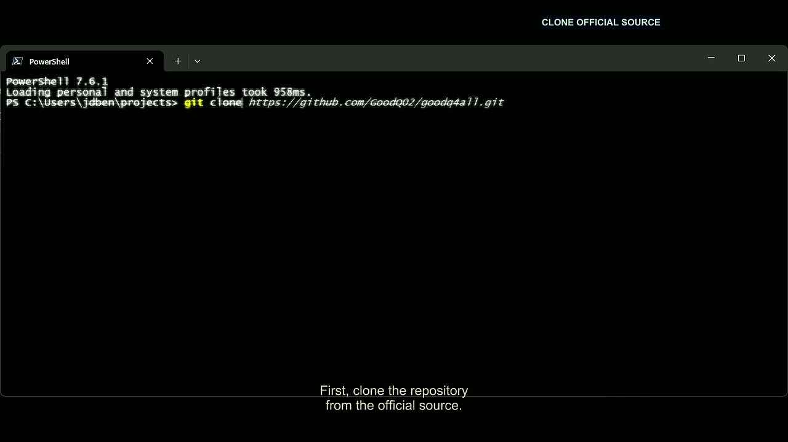
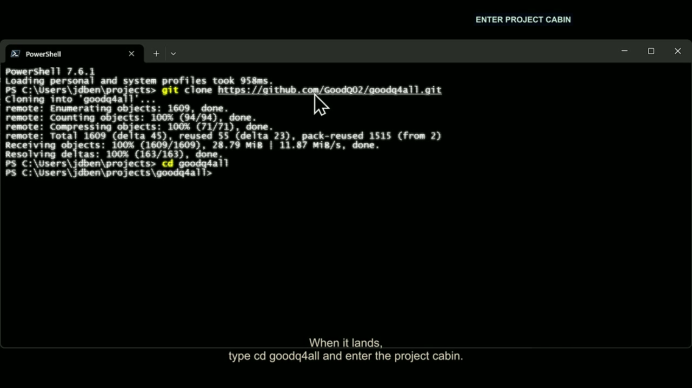
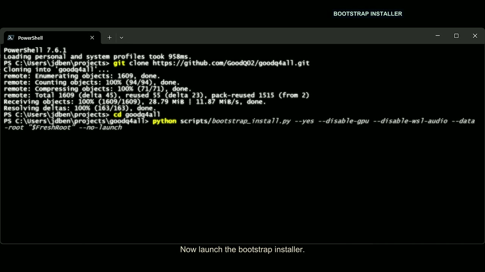
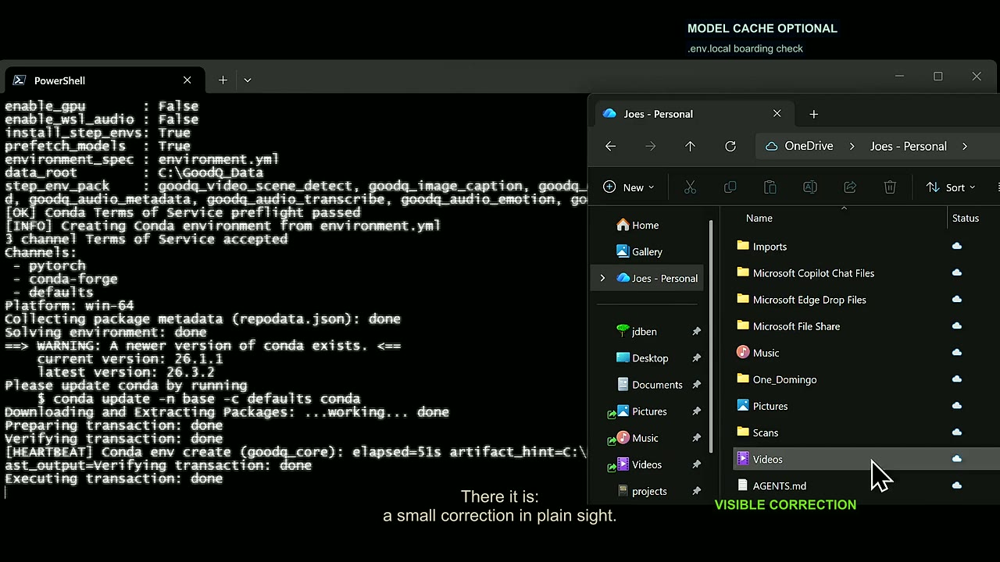
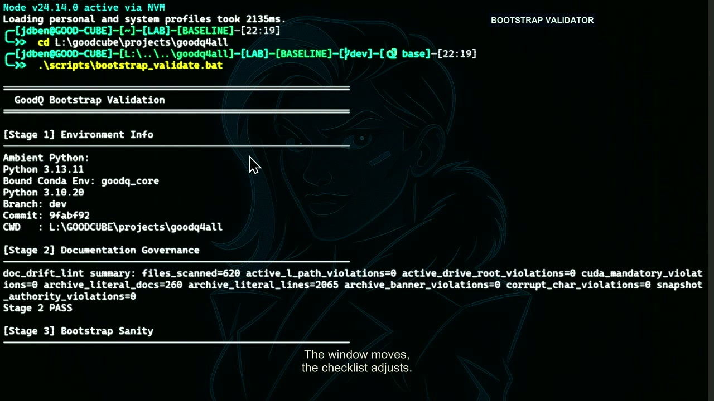
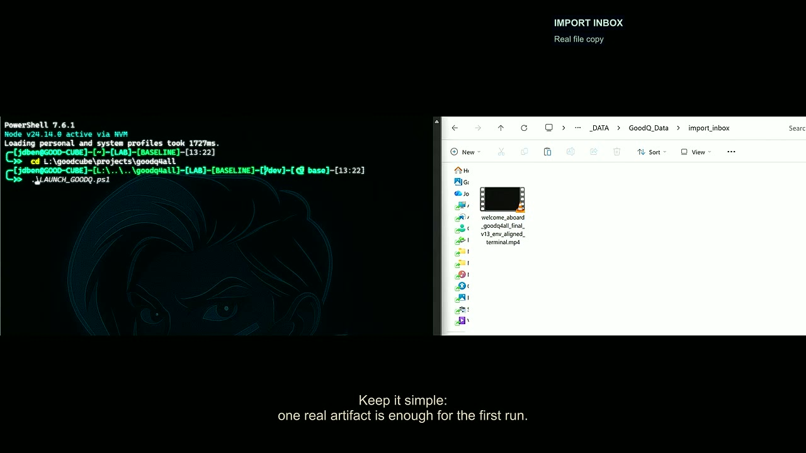
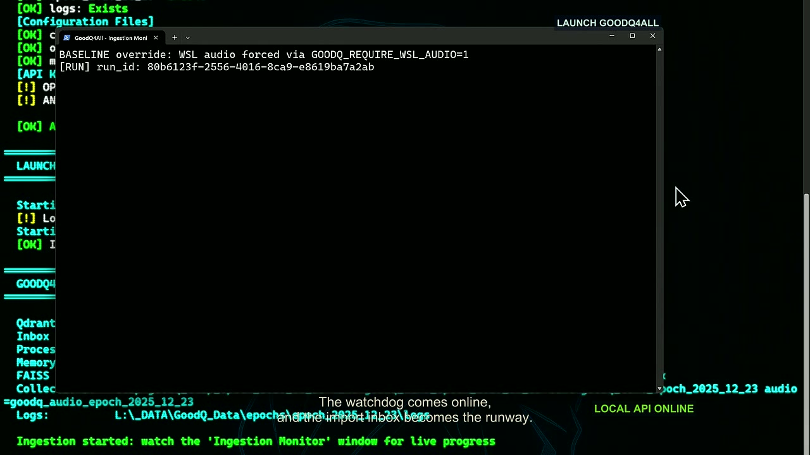
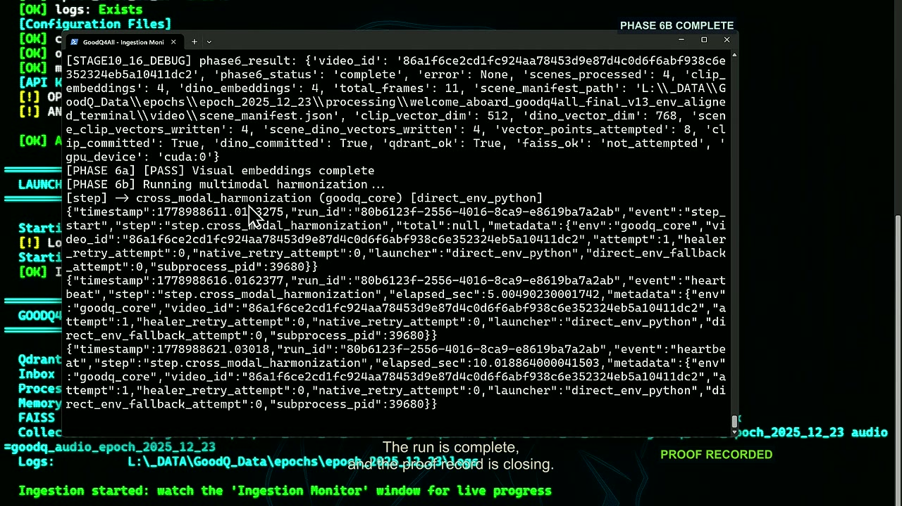
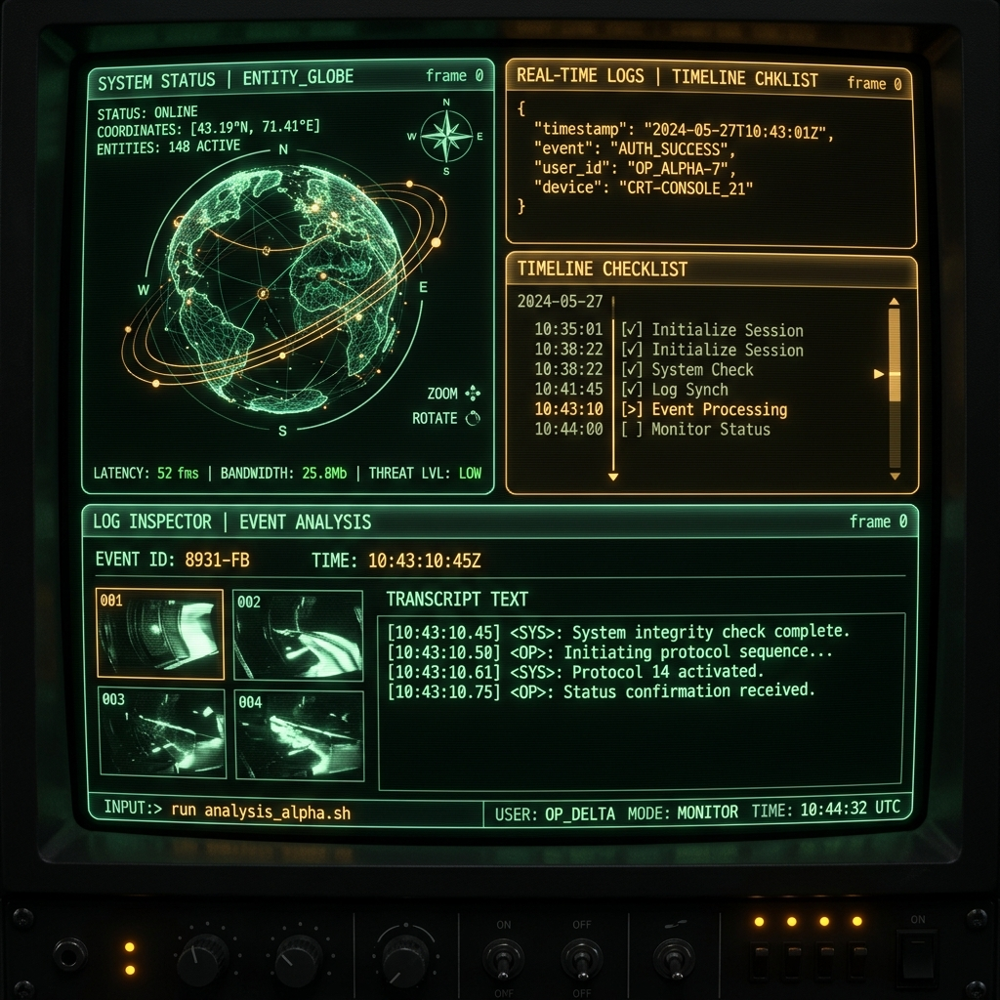

<!-- DOC_BADGE: CANONICAL -->
<!-- DOC_STATUS: AUTHORITATIVE -->
<!-- DOC_LAST_VERIFIED: 2026-05-19 -->

<p align="center">
  
</p>

# GoodQ4All

<p align="center">
  <a href="https://github.com/GoodQ02/goodq4all/actions/workflows/ci.yml"></a>
  <a href="https://github.com/GoodQ02/goodq4all/actions/workflows/doc-drift-lint.yml"></a>
  <a href="https://github.com/GoodQ02/goodq4all/actions/workflows/codeql.yml"></a>
  <a href="https://github.com/GoodQ02/goodq4all/actions/workflows/dependency-review.yml"></a>
</p>

GoodQ4All is a local-first multimodal memory system for long-running video, audio, and text intelligence.


It ingests media into scene-level memory, persists what it learns locally, and keeps the proof path visible. The system is built around deterministic Windows-first execution, with CPU-safe baseline behavior and optional GPU / WSL2 acceleration when you want more throughput.

GoodQ4All's thesis is simple: machine memory should earn every claim it makes.

> [!IMPORTANT]
> **Supported Host: Windows 11 only.** GoodQ4All is built for Windows-first local execution (CPU-safe baseline by default; GPU and WSL2 are optional). Other platforms are not first-run targets today.

## Watch The Guided Demos

Turn raw media into structured multimodal memory locally:

1. **Raw Media Input**: A sample clip of the Apollo 11 moon landing.
2. **Interactive UI Walkthrough**: Ingest the clip, explore the Retro Memory Explorer's 3D spinning entity globe, perform human-in-the-loop voice stitching, and save custom memory collections.
3. **Terminal & Installation Walkthrough**: Bootstrap the local dependencies, validate the host environment, start the background watchdog, and import media files in real-time.

<table width="100%" border="0" cellspacing="0" cellpadding="10">
  <tr>
    <td align="center">
      <h1><b>TURN THIS...</b></h1>
      <br />
      
    </td>
  </tr>
  <tr>
    <td align="center">
      <h1><b>INTO THIS,</b></h1>
      <p><a href="samples/assets/ui_onboarding_walkthrough.mp4">Watch 1080p Video</a> · <a href="samples/assets/manifest.json">View Manifest</a></p>
      <br />
      <a href="samples/assets/ui_onboarding_walkthrough.mp4">
        
      </a>
    </td>
  </tr>
  <tr>
    <td align="center">
      <h1><b>WITH THIS.</b></h1>
      <p><a href="samples/assets/install_walkthrough.mp4">Watch 1080p Video</a> · <a href="docs/guides/install/INSTALL.md">Read Install Guide</a></p>
      <br />
      <a href="samples/assets/install_walkthrough.mp4">
        
      </a>
    </td>
  </tr>
</table>


## Before You Start

GoodQ4All's supported first-run host is Windows 11 with PowerShell. The runtime
is local-first and CPU-safe by default; GPU and WSL2 acceleration are optional.

Have these ready before running the installer:

- Windows 11
- Git
- Miniconda or Anaconda available to the current shell
- Python 3.10 or newer
- at least 25 GB free for the baseline install path (breakdown: ~4 GB conda environments, ~12 GB model cache prefetch, ~6 GB processing workspace, ~3 GB database storage; space required is lower if model prefetch is skipped)
- optional: NVIDIA GPU and WSL2 Ubuntu for accelerated lanes

macOS and Linux are not first-run hosts for this repository today. See
[`docs/reference/PLATFORM_SUPPORT.md`](docs/reference/PLATFORM_SUPPORT.md) for
the current platform contract.

## Visual First Run

Each frame below is pulled from the final onboarding film and paired with the action it narrates. Click any frame to enlarge it.

| Step | Type or do this | Demo frame |
| --- | --- | --- |
| 1 | Clone the official source:<br>`git clone https://github.com/GoodQ02/goodq4all.git` | <a href="samples/assets/demo-steps/01-clone-official-source.jpg"></a> |
| 2 | Enter the project cabin:<br>`cd goodq4all` | <a href="samples/assets/demo-steps/02-enter-project-cabin.jpg"></a> |
| 3 | Run the bootstrap installer:<br>`python scripts/bootstrap_install.py`<br><sub>CPU-safe first-run variant: `python scripts/bootstrap_install.py --disable-gpu --disable-wsl-audio --skip-model-prefetch`.</sub> | <a href="samples/assets/demo-steps/03-bootstrap-installer.jpg"></a> |
| 4 | Customize local config:<br>edit the bootstrap-created `.env.local` when using local model, cache, or provider settings. | <a href="samples/assets/demo-steps/04-env-local-root.jpg"></a> |
| 5 | Validate the bootstrap:<br>`.\scripts\bootstrap_validate.bat` | <a href="samples/assets/demo-steps/05-bootstrap-validator.jpg"></a> |
| 6 | Run the launcher/readiness check:<br>`.\LAUNCH_GOODQ.ps1` | <a href="samples/assets/demo-steps/06-launch-goodq.jpg"></a> |
| 7 | Start Watchdog, then copy one small media file into the import inbox zone (defaults to `%USERPROFILE%\GoodQ_Data\import_inbox\`):<br>`conda run --no-capture-output -n goodq_core python -m cli.watchdog` | <a href="samples/assets/demo-steps/07-watchdog-observes.jpg"></a> |
| 8 | Start the API and inspect proof:<br>`conda run --no-capture-output -n goodq_core python -m api.server` | <a href="samples/assets/demo-steps/08-proof-recorded.jpg"></a> |

## First Success Loop

If you are new here, start by making one memory:

1. Confirm the Windows 11, Conda, Git, and free-space prerequisites above.
2. Bootstrap and validate the repo.
3. Start Watchdog.
4. Drop one small media file into the configured `import_inbox`.
5. Open the local API docs.
6. Confirm scene artifacts were written.

Guide:

- [`docs/guides/FIRST_RUN.md`](docs/guides/FIRST_RUN.md)

## What This Actually Is

GoodQ4All is not just an ingest runner or a benchmark harness. It is a full local memory stack with five major layers:

- **Perception engine**
  Detects scenes, extracts keyframes, runs OCR and captions, tags objects and faces, transcribes audio, tracks speakers, and generates embeddings across modalities.

- **Interpretation engine**
  Turns raw perception into scene meaning through `scene_context_llm`, epistemic evidence surfaces, arbitration, and Phase 6 multimodal harmonization. Phase 6 is the final harmonization step that turns per-scene outputs into coherent temporal and vector memory.

- **Memory engine**
  Persists scene manifests, temporal indexes, SQLite memory state, knowledge graph state, and Qdrant vectors as durable local memory rather than disposable run logs.

- **Retrieval engine**
  Supports vector search, KG-backed querying, natural-language lookup, and scene-level analysis against persisted memory.

- **Operations layer**
  Exposes bootstrap, validation, watchdog, health, monitoring, and release-evidence surfaces so the system can be run and audited like infrastructure, not just a script.

## Why This Project Exists

Most media-intelligence stacks are either:

- cloud-dependent
- opaque when they fail
- or impressive in demos but weak under long-running, real-world ingestion

GoodQ4All is trying to be the opposite:

- local-first
- scene-centric
- auditable
- resilient under partial failure

The design goal is simple: a working memory system is more valuable than a clever one.

## What Is Proven Today

Release `0.1.1` is the current supported checkpoint.

What is actually proven, not just intended:

- The canonical runtime is Windows-first and local-first.
- The supported surface is API + CLI + watchdog + persisted runtime artifacts.
- Scene-context interpretation quality is witness-proven, not just anecdotal.
- Phase 6 harmonization is operating cleanly on the proving run.
- Episode-quality scoring now has a local offline eval lane using curated IMDb-backed anchors for audit only.

Post-release operator validation on the current `main` / `public` line additionally proves:

- WSL audio readiness now means real offline diarization loadability, not import-only checks.
- Successful unified audio preserves diarization and emotion sub-step truth instead of hiding partial failures behind a coarse success result.
- Speaker continuity now persists through `scene_ingest_results.json`, `scene_manifest.json`, and `temporal_index.json`.
- Episode-to-episode continuity is proven on fresh Season 5 material, not just on the release-era comparison witness.
- API scene read models now expose persisted speaker-truth and continuity fields instead of thinner legacy projections.
- Similar-scene retrieval is now a real multimodal feature and can fuse text, visual, and audio memory instead of falling back to an empty path.
- Read-only control recurrence reporting can compare witnesses, index durable artifacts, draft deterministic inspection plans, and derive conservative trends from existing JSON reports without healing or mutation.

Current proving run and release proof path:

- [`docs/releases/RELEASE_0.1.1.md`](docs/releases/RELEASE_0.1.1.md)
- [`docs/releases/SHIP_PROFILE.md`](docs/releases/SHIP_PROFILE.md)
- [`reports/README.md`](reports/README.md)

Current eval result on the proving witness:

- `6/6` core beats covered
- `9.0/9.0` salience weight hit

That result comes from the local episode-reference eval lane and is summarized in the release checkpoint and evidence map above.

## Verify It Yourself

### What Runs What

- `LAUNCH_GOODQ.ps1` checks readiness and opens operator monitors.
- Watchdog watches the configured `import_inbox`.
- `cli.run_ingestion` owns actual ingestion.
- The API is a local read and inspection surface.
- Runtime artifacts are the durable proof.

### First Local Run

If you want the shortest honest path to "does this work on this machine?", run
the same first success loop with the actual commands rather than only starting
the API:

1. Clone the repo and enter the project root.
2. Run the bootstrap installer.
3. Run the bootstrap validator.
4. Run the safe launcher/readiness check.
5. Start Watchdog in one terminal.
6. Drop one small media file into the configured `import_inbox`.
7. Start the API in another terminal.
8. Inspect health and local docs.

```powershell
git clone https://github.com/GoodQ02/goodq4all.git
cd goodq4all
python scripts/bootstrap_install.py
.\scripts\bootstrap_validate.bat
.\LAUNCH_GOODQ.ps1
```

`LAUNCH_GOODQ.ps1` checks readiness and opens operator monitors. It does not start ingestion by itself. To launch with background watchdog ingestion enabled:
```powershell
.\LAUNCH_GOODQ.ps1 -StartIngestion
```

The launcher also has `LAUNCH_GOODQ.bat` for double-click or classic Command
Prompt use. Both wrappers reach the same readiness surface.

If you skipped the Qdrant service prompt during bootstrap, the launcher health check will display:
```text
  [!] Qdrant: Not responding
      Attempting to start Qdrant service...
  [!!] Qdrant: Failed to start - manual intervention required
```
- **When is it safe to ignore?** During your first install verify or when running purely CPU-safe dry runs where vector index lookups are not required.
- **When must it be fixed?** Before running active ingestion (`-StartIngestion` or Watchdog importing files) that updates vector stores, or when executing retrieval queries. Fix it by running:
  ```powershell
  .\scripts\qdrant\INSTALL_QDRANT_SERVICE.bat
  ```
  (Requires Administrator shell).

Leave Watchdog running in one terminal:

```powershell
conda run --no-capture-output -n goodq_core python -m cli.watchdog
```

Copy one small media file into the configured inbox, then start the API in
another terminal. `GOODQ_DATA_ROOT` is the base root; the runtime derives the
drop zone as `<GOODQ_DATA_ROOT>\GoodQ_Data\import_inbox\`.

```powershell
conda run --no-capture-output -n goodq_core python -m api.server
```

Then open:

- `http://127.0.0.1:30000/api/health/summary`
- `http://127.0.0.1:30000/docs`
- `http://127.0.0.1:30000/ui/operator_console_v1/` (Classic Operator Console)
- `http://127.0.0.1:30000/ui/retro_console_v1/` (Retro Memory Explorer)

The host and port default to `GOODQ_API_HOST=127.0.0.1` and
`GOODQ_API_PORT=30000` and can be overridden in `.env.local`.

Reference:

- [`docs/guides/FIRST_RUN.md`](docs/guides/FIRST_RUN.md)
- [`docs/guides/watchdog/WATCHDOG_QUICKREF.md`](docs/guides/watchdog/WATCHDOG_QUICKREF.md)
- [`docs/bootstrap/INSTALL_BOOTSTRAP.md`](docs/bootstrap/INSTALL_BOOTSTRAP.md)
- [`docs/reference/API.md`](docs/reference/API.md)


## Supported Surface Today

GoodQ4All currently supports:

- local install and bootstrap on Windows
- local API runtime
- read-only local operator console served by the API process
- CLI ingestion
- watchdog-driven long-running ingestion
- SQLite + knowledge graph + Qdrant-backed persisted memory
- CPU-safe baseline execution with optional GPU / WSL acceleration

GoodQ4All now ships two local read-only operator console variants:
- **Classic Operator Console** served at `/ui/operator_console_v1/`. It exposes the Current Scope strip, Flight Deck, proof/evidence status, recurrence reports, and video inventories.
- **Retro Memory Explorer (v1.4.7)** served at `/ui/retro_console_v1/`. A premium cyber-CRT dashboard featuring a four-panel resizable/collapsible layout with floating restore tabs, an entity co-occurrence graph with dynamic spacing zoom and flight transitions, an Inspector panel containing keyframe image/transcript views with resizable logs splitters, and bidirectional timeline checklists.

<p align="center">
  
</p>

The consoles are inspection surfaces only. They do not trigger ingestion, reindex memory, heal configs, mutate database structures, generate reports, or activate ControlAgent. A polished consumer memory browser and confirmation-gated mutation UI remain future layers.

UI status & details:

- [`docs/guides/ui/JUSTIFICATION_UI.md`](docs/guides/ui/JUSTIFICATION_UI.md)
- [ui/operator_console_v1/README.md](ui/operator_console_v1/README.md)
- [ui/retro_console_v1/README.md](ui/retro_console_v1/README.md)

## What Makes It Different

- **Scene-centric memory**
  Every major interpretation surface is built around scenes as the atomic unit.

- **Full perception-to-memory pipeline**
  The system does not stop at captions or transcripts. It carries perception forward into harmonized scene truth, temporal rollups, graph relationships, and retrieval surfaces.

- **Knowledge graph with conservative identity logic**
  People, concepts, objects, places, speaker patterns, and identity evidence are persisted locally, with promotion rules designed to avoid hallucinated merges.

- **Audit-first quality**
  The system is tuned with witnesses, diagnostics, and reference evals instead of vibes.

- **Local truth boundary**
  Public episode anchors can inform audit and scoring, but they do not overwrite runtime scene evidence.

- **Controlled acceleration**
  GPU and WSL are additive performance layers, not hidden requirements.

- **Failure visibility**
  Optional enrichments may fail without collapsing the whole run, and the failure path is meant to remain visible.

## Architecture at a Glance

- **Host:** Windows 11 is the canonical runtime host
- **Profiles:** `UNSET`, `BASELINE`, `GPU_ENHANCED`
- **Perception:** scene detection, captions, OCR, object signals, face signals, transcription, diarization, emotion, and embeddings
- **Storage:** SQLite + knowledge graph + Qdrant
- **Memory surface:** scene manifests, temporal index, projected run outputs
- **Core interpretation layer:** `scene_context_llm` with `primary_tags`, `contextual_tags`, and `structural_tags`
- **Identity layer:** speaker patterns, voice-pattern matches, identity candidates, supported identities, and evidence edges
- **Fusion layer:** Phase 6 / Phase 6b harmonization
- **Operator surface:** API + CLI + watchdog + validation and diagnostics

If you want the deeper technical picture:

- [`docs/architecture/README.md`](docs/architecture/README.md)
- [`docs/architecture/SYSTEM_ARCHITECTURE.md`](docs/architecture/SYSTEM_ARCHITECTURE.md)
- [`docs/architecture/ARCHITECTURE_REFERENCE.md`](docs/architecture/ARCHITECTURE_REFERENCE.md)
- [`docs/architecture/MEMORY_STORAGE.md`](docs/architecture/MEMORY_STORAGE.md)
- [`docs/architecture/diagrams/`](docs/architecture/diagrams/)
- [`docs/PHASE6_MULTIMODAL_FUSION.md`](docs/PHASE6_MULTIMODAL_FUSION.md)

## Start Here

- Guided demo: [`docs/guides/DEMO.md`](docs/guides/DEMO.md)
- First run: [`docs/guides/FIRST_RUN.md`](docs/guides/FIRST_RUN.md)
- Install: [`docs/guides/install/INSTALL.md`](docs/guides/install/INSTALL.md)
- Quickstart: [`docs/guides/install/QUICKSTART.md`](docs/guides/install/QUICKSTART.md)
- Laptop profile: [`docs/guides/install/LAPTOP.md`](docs/guides/install/LAPTOP.md)
- Clean memory start: [`docs/guides/CLEAN_MEMORY_START.md`](docs/guides/CLEAN_MEMORY_START.md)
- Uninstall / clean-slate: [`docs/guides/install/UNINSTALL.md`](docs/guides/install/UNINSTALL.md)
- Docs landing page: [`docs/README.md`](docs/README.md)
- API reference: [`docs/reference/API.md`](docs/reference/API.md)
- Current release checkpoint: [`docs/releases/RELEASE_0.1.1.md`](docs/releases/RELEASE_0.1.1.md)
- Support and reporting: [`SUPPORT.md`](SUPPORT.md)

## Current Limitations

- This is pre-1.0 software. The supported runtime path is stable enough to use, but surrounding helpers and APIs may still evolve.
- A polished product UI is not part of the current shipping surface.
- Some optional enrichments can still fail on individual scenes without invalidating the whole ingest.
- Audio-vector success is provenance-defined: current-run CLAP/Qdrant coverage requires `clap_meta.status == ok` plus a Qdrant audio payload with matching `run_id` and required provenance fields. Legacy scene-id matches are not current-run proof.
- Context weighting is now strong, but the project still treats some interpretation choices as policy-level texture rather than frozen truth.

## Security and Data Handling

- Secrets belong in `.env.local` only.
- The canonical runtime does not require cloud execution.
- Local storage is the source of truth.
- Public benchmark and eval materials describe outcomes and metrics, not copyrighted transcript dumps.

Reference:

- [`SUPPORT.md`](SUPPORT.md)
- [`SECURITY.md`](SECURITY.md)
- [`THIRD_PARTY_NOTICES.md`](THIRD_PARTY_NOTICES.md)

## For Maintainers & Advanced Operators

These resources are for reviewing release validation reports, agent status logs, system snapshots, and advanced audit trails:

- **Release Proving Witness:** [`docs/releases/RELEASE_0.1.1.md`](docs/releases/RELEASE_0.1.1.md)
- **Active Ship Profile:** [`docs/releases/SHIP_PROFILE.md`](docs/releases/SHIP_PROFILE.md)
- **Agent Status Log:** [`docs/goodq4all_agent_status.md`](docs/goodq4all_agent_status.md)
- **System Snapshot:** [`docs/SYSTEM_SNAPSHOT.md`](docs/SYSTEM_SNAPSHOT.md)
- **Validation Run Reports:** [`reports/README.md`](reports/README.md)
- **Diagnostics Guide:** [`docs/diagnostics/README.md`](docs/diagnostics/README.md)

Historical and superseded material is intentionally preserved under [`docs/archive/`](docs/archive/), but it is not the front door.

## License

MIT. See [`LICENSE`](LICENSE).
