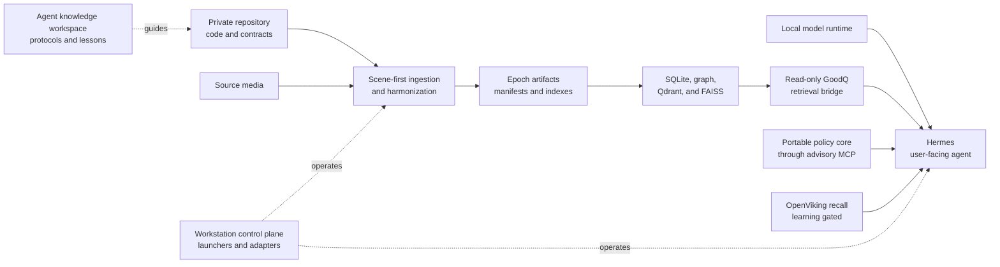

<!-- DOC_BADGE: OPERATIONAL -->
<!-- DOC_STATUS: TIMELESS_AGENT_OVERVIEW -->
<!-- DOC_LAST_VERIFIED: 2026-08-20 -->

# GoodQ Project Orientation

## Purpose

This is the incoming-shift report for an agent joining GOOD-CUBE.

Read it before current-state notes. It explains the durable shape of the project,
where authority lives, how the parts relate, and how to avoid repeating completed
work. It does not describe which services are running, which epoch is active, or
which branch is currently paused.

Use current-state documents and live probes only after this overview has supplied
the frame needed to interpret them.

## One Project, Multiple Roots

GOOD-CUBE has one primary development project: GoodQ. Its source, persisted data,
machine control plane, local agent, and reusable doctrine live in separate roots
because they have different safety and portability requirements. Those roots are
parts of one system, not competing product authorities.

| Logical root | How to resolve it | Durable responsibility |
|---|---|---|
| `<repo_root>` | Private `goodq4all` development checkout | Product source, tests, contracts, migrations, and repository agent policy |
| `<data_root>` | `GOODQ_DATA_ROOT` through the config loader | Source media, epoch stores, model assets, Qdrant storage, and durable runtime artifacts |
| `<tools_root>` | `%SYSTEMDRIVE%\Tools` on the primary workstation | Machine launchers, Hermes runtime, model serving, MCP adapters, local utilities, logs, and recovery material |
| `<hermes_home>` | `HERMES_HOME`, normally beneath `<tools_root>` | User-facing agent configuration, sessions, skills, and local memory-provider wiring |
| `<portable_agent_root>` | Discover the `goodq_agent` checkout by repository identity | Portable policy/preflight package intended for later desktop/laptop alignment |
| `<agent_knowledge_root>` | Resolve `%SYSTEMDRIVE%\Tools\AGENT_TRAINING.lnk`; never assume its backing drive | Shared protocols, workflows, host profiles, lessons, and reusable operating doctrine |

The primary Windows desktop is the development and data authority. A laptop or
public checkout is a follower or release surface. Neither may silently become a
second development authority.

## Authority Depends on the Question

There is no honest single ladder for every kind of truth. First identify what is
being asked.

### What actually happened?

Use direct persisted and runtime evidence:

1. epoch manifests, SQLite stores, Qdrant, FAISS, durable run artifacts, and logs
2. current process, listener, configuration-resolution, and health output
3. targeted probes that do not mutate the system

An old status page cannot overrule a populated promoted store. A running process
does not prove that its output is correct.

### What is the system intended to do?

Use implementation and contract authority:

1. current private repository code and focused tests
2. canonical architecture, orchestration, persistence, and identity contracts
3. active operational workflows and repository agent instructions

Passing tests prove the tested contract. They do not prove that a historical run
used the new code or that a service is currently running.

### How should an agent operate?

Use this order:

1. explicit user direction and applicable platform safety rules
2. the nearest active `AGENTS.md` for the work being performed
3. this project orientation and the canonical contract for the subsystem
4. active operational workflows
5. approved doctrine and lessons from `<agent_knowledge_root>`
6. historical handoffs, session transcripts, cheat sheets, and model memory

Historical material is evidence about the past. It is never permission to mutate
the present.

## Four Kinds of State

Do not mix these categories in one document or conclusion.

| State class | Examples | Expected lifetime |
|---|---|---|
| Invariant | local-first doctrine, scene atomicity, read-only boundaries, branch authority | Long-lived |
| Topology | which root owns source, data, control, memory, or release duties | Long-lived, changed deliberately |
| Operational state | active epoch, listeners, branch pause point, loaded model, queue depth | Short-lived; always re-probe |
| Evidence | test reports, audit memos, Antigravity sessions, logs, screenshots | Historical proof with a scope and date |

This overview owns invariants and topology. `CURRENT_STATE.md` and
`current_state.json` own a restart-oriented snapshot. Live probes own the final
answer to time-sensitive questions.

## Why the Repair Roadmap Exists

GoodQ's core pipeline has proven its central path on the July 2026 home-memory
corpus. That corpus was ingested and promoted, providing durable evidence that
the scene-first multimodal path works for it. The repair roadmap is not
permission to rebuild or re-ingest that corpus. Its purpose is to transform a
successful but organically assembled system into one whose authority is
explicit, dependable, portable, and safe to extend.

The ordered repair phases establish:

- **Repository truth:** preserve wanted work and eliminate branch and document
  ambiguity.
- **Evidence truth:** ensure tests and reports cannot falsify operator evidence.
- **Control authority:** establish exactly which component may approve or
  perform an action.
- **Runtime ownership:** create one reliable startup, watchdog, and recovery
  path.
- **Security boundaries:** keep raw services private and introduce controlled
  access.
- **Identity quality:** promote people and speaker mappings only after human
  confirmation.
- **Portability:** align follower systems without creating a second development
  authority.
- **Release integrity:** reconcile the public repository only after private
  verification.

These are one stabilization program, not invitations to create parallel
architectures. Each repair must preserve the working asset, close one proven
seam, and leave clearer authority for the next operator.

## System Relationship



The arrows do not confer authority beyond the stated boundary. Hermes can read
GoodQ through the bridge without becoming an ingestion owner. OpenViking can
remember approved context without becoming project truth. A model can reason
about evidence without becoming evidence.

## Component Boundaries

### GoodQ repository

- Owns product behavior and contracts.
- Owns the canonical ingestion entrypoint and persistence semantics.
- Requires scene-first, evidence-first repair.
- Does not treat machine launchers or agent memory as source authority.

### Data root

- Owns persisted outcomes and large local assets.
- Is not a scratch directory.
- Must not be cleaned, re-ingested, re-promoted, or reorganized without an
  evidence-backed manifest and explicit approval.

### Workstation control plane

- Owns launchers, model-serving integration, MCP adapters, and local health tools.
- May observe or adapt GoodQ through documented interfaces.
- Must not fork product architecture or silently mutate canonical stores.
- Upstream/reference repositories beneath the tools root retain their own local
  coding rules but do not become separate GoodQ product authorities.

### Hermes and the read-only bridge

- Hermes is the primary user-facing local agent surface.
- The GoodQ bridge is read-only and bounded; it is not a hidden mutation path.
- Context packs and prompts are operational aids. Their epoch/store claims must be
  checked against resolved config and live stores before use.

### Portable GoodQ agent and governor MCP

- The portable package is the candidate policy core for cross-machine alignment.
- The Hermes governor MCP is advisory and non-executing.
- Before packaging or upgrading, compare portable assets with the repository's
  embedded contracts. Do not assume equal version labels mean equal contracts.

### Context7 public reference

- The registered Context7 library `/goodq02/goodq4all` indexes the downstream
  public `main` branch. It is a useful public-documentation reference, not a
  private-development authority.
- Before using it for a GoodQ claim, resolve the library again and record its
  observable `state` and `lastUpdateDate` in the task evidence.
- If the library is not finalized, its update predates the relevant private
  change, or its text conflicts with the private checkout, use current private
  code and canonical contracts instead.
- Context7 freshness proves only the indexed public source's age. It does not
  prove that private checkpoints, live services, or persisted runtime artifacts
  match that public snapshot.

### OpenViking

- Supplies recall and approved durable memory to Hermes.
- Normal GoodQ sessions are recall/read-only unless learning is explicitly enabled
  for that process.
- Memory is not code, policy, configuration, persisted pipeline truth, or user
  authorization.

### Antigravity, agent sessions, and cheat sheets

- Useful for discovering intent, prior experiments, screenshots, and test evidence.
- Never outrank live artifacts, current code, or active contracts.
- A declaration of victory proves only the checks named in that session.

## Mandatory No-Repeat Preflight

Before proposing implementation, cleanup, ingestion, promotion, rebuild, or setup:

1. State the exact seam or question.
2. Read the nearest active instructions and this overview.
3. Inspect the current branch, worktrees, and local changes without altering them.
4. Inspect the relevant persisted/runtime surface read-only.
5. Read the most focused current handoff or contract for that seam.
6. List what is already complete, what is merely configured, and what remains
   unproven.
7. Name the actions that must not be repeated.
8. Propose only the smallest unfinished unit.

If those steps cannot distinguish incomplete work from stale documentation, stop
and gather better evidence. Do not rerun the broad workflow to find out.

## Worktrees, Branches, and Release Mirrors

- Private `dev` is the product-development authority.
- Short-lived worktrees and feature branches isolate active seams; they do not
  create new product authorities.
- A worktree's checked-in instructions are a snapshot from its branch point. Before
  destructive Git or governance actions, compare them with the current private
  development policy. If they disagree, stop; do not delete or reset to reconcile
  documentation mid-checkpoint.
- Preserve unrelated dirty-tree work. Stage and commit only named files.
- The public checkout is a downstream release mirror. It is not assumed to be
  byte-identical between releases and must not originate private development fixes.

## Common False Inferences

| Observation | Unsafe inference | Correct interpretation |
|---|---|---|
| Code and tests for a feature exist | The historical data used that feature | Verify artifact provenance and run timing |
| A service is configured | It is running and healthy | Probe the listener and smallest health surface |
| A process is running | The complete stack is healthy | Verify its dependents and persisted output |
| A status document says work is incomplete | Broad work should be rerun | Compare with live persisted evidence first |
| A model or agent produced a confident summary | The summary is authority | Trace every important claim to a truth surface |
| Two packages have the same version | Their contracts are aligned | Compare packaged assets or checksums |
| A context pack is readable | Its epoch and collection claims are current | Compare against resolved config and stores |
| A worktree has an older rule | Branch cleanup is authorized | Treat it as a branch snapshot and reconcile safely |
| Files occupy substantial storage | They are disposable cache | Classify source, durable output, cache, and backup first |

## Incoming-Shift Checklist

An incoming agent should be able to answer these questions before changing the
system:

1. What precise outcome did the operator request?
2. Which root owns that outcome?
3. Is the question about intended behavior, actual runtime state, or historical
   evidence?
4. What is the nearest applicable instruction file?
5. What work is already complete?
6. What local changes or worktrees must be preserved?
7. What is the smallest probe that can close the uncertainty?
8. What action would accidentally repeat or widen prior work?

## Outgoing-Shift Handoff

Leave a concise report with these fields:

```text
Objective:
Authority surfaces checked:
Verified complete:
Still unproven:
Files or services changed:
Targeted validation:
Do not repeat:
Exact resume seam:
Approval still required:
```

Do not turn a handoff into a second architecture document. Link durable contracts,
record transient evidence in the appropriate state or diagnostic surface, and keep
this overview unchanged unless topology or authority actually changes.

## Deeper Authority

- [Documentation Authority Map](../bootstrap/doc_authority_map.md)
- [Agent Office](README.md)
- [Agent Decision Protocol](../architecture/AGENT_DECISION_PROTOCOL.md)
- [Ingest Orchestration Contract](../architecture/INGEST_ORCHESTRATION_CONTRACT.md)
- [Identity Stitching Contract](../architecture/IDENTITY_STITCHING_CONTRACT.md)
- [System Architecture](../architecture/SYSTEM_ARCHITECTURE.md)
- [Memory and Storage Architecture](../architecture/MEMORY_STORAGE.md)
- [Evidence-First Runtime Repair](workflows/EVIDENCE_FIRST_RUNTIME_REPAIR.md)
- [Hermes Personal-Memory Retrieval](workflows/HERMES_PERSONAL_MEMORY_RETRIEVAL.md)
