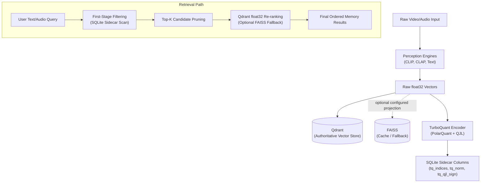

<!-- DOC_BADGE: CANONICAL -->
<!-- DOC_STATUS: AUTHORITATIVE -->
<!-- DOC_LAST_VERIFIED: 2026-07-11 -->

# GoodQ System Architecture

**Last Updated:** 2026-07-11
**Status:** Operational, with runtime truth determined by fresh artifacts and health checks  
**Verification Basis:** stitching-era witnesses, epoch-scoped storage, and canonical CLI/runtime contracts

---

## Executive Summary

GoodQ4All is a local-first, scene-centric multimodal memory system.

The current architecture is defined by these truths:
- Windows desktop is the canonical host
- `cli/run_ingestion.py` is the canonical orchestration owner
- scene bundles are durable per-video artifact evidence
- WSL is an optional audio compute extension, not a peer runtime
- Qdrant is the canonical vector store
- SQLite is the canonical active relational memory and graph store after the
  governed materialization gate
- Phase 6 is wired and operational
- identity formation is conservative and evidence-based

Static docs should describe those truths. Per-run status should be derived from current witnesses, not from aspirational claims.

---

## Architecture Layers

```text
User / Operator
  -> CLI surfaces
  -> Watchdog / observability
  -> run_ingestion orchestration
  -> scene-first processing
  -> epoch-scoped persistence
  -> retrieval / query helpers
```

### 1. Operator Layer

Active operator surfaces include:
- `python -m cli.run_ingestion`
- `python -m cli.watchdog`
- `python -m cli.monitor_ingestion`
- `python -m cli.system_status`
- `python -m cli.print_config`
- `python -m cli.retrieve`
- `python -m cli.nl_query`

The CLI is authoritative. Older service-era launch assumptions should not be treated as the active system shape.

### 2. Orchestration Layer

**Canonical owner:** `cli/run_ingestion.py`

Responsibilities:
- discover input media
- detect scenes
- run scene steps and step-specific environments
- persist per-video scene artifacts
- stage UCF/Qdrant evidence under isolation, or write active stores only when
  the configured lifecycle permits it
- invoke Phase 6
- write canonical run summaries

The orchestration contract is frozen in [INGEST_ORCHESTRATION_CONTRACT.md](INGEST_ORCHESTRATION_CONTRACT.md).

### 3. Processing Layer

Scene-first processing remains the core design:
- scene detection
- per-scene keyframe processing
- per-scene audio processing
- semantic/entity extraction
- lifecycle-governed KG projection
- Phase 6 multimodal fusion

The system is resilient by design:
- optional enrichments may fail
- scene bundles remain canonical when partial failures are truthfully recorded
- fallback behavior must remain visible

### 4. Persistence Layer

Canonical persistence is epoch-scoped:

```text
${GOODQ_DATA_ROOT}/GoodQ_Data/epochs/<epoch>/
```

Key persisted surfaces:
- `memory.db`
- `knowledge_graph.db`
- `ucf/ucf_ledger.db`
- `output/scene_ingest_results.json`
- `processing/<video_name>/video/scene_manifest.json`
- `processing/<video_name>/temporal_index.json`
- Qdrant collections

### Governed materialization boundary

Under `ingestion_isolation: true`, `scene_manifest.json` and
`temporal_index.json` are per-video artifact evidence. The epoch ledger is
`ucf/ucf_ledger.db`. `ucf_ledger.db` is the lifecycle and evidence authority.
Isolated ingest stages UCF context frames there and Qdrant points with
`ucf_promotion_status = staged`; it suppresses direct writes to active
`memory.db` and `knowledge_graph.db`.

Explicit `validate_ucf_frames` validation must precede the separately approved,
human-gated `promote_ucf_to_memory` operation. That operation is bound to one
exact `video_hash` plus `epoch_id` scope and materializes active `memory.db` and
`knowledge_graph.db`.

The UCF status mutation, transition audit, and durable Qdrant outbox enqueue
share one immediate SQLite transaction in `ucf_ledger.db`. Active-view cleanup
is compensating/recoverable work across independent stores; the architecture
does not claim cross-store ACID. Post-commit Qdrant status delivery and
reconciliation are separate durable, recoverable obligations.
`promotion_committed_sync_pending` means the active materialization and UCF
commit succeeded, but durable Qdrant status delivery is still pending.

Default active retrieval exposes only promoted evidence. Explicit raw audit queries
may inspect other lifecycle states without turning them into active memory.

### 5. Retrieval / Memory Layer

Current active memory behavior is built from:
- promoted scene and segment views
- Qdrant vectors filtered to promoted lifecycle state
- active KG materialization
- temporal rollups retained as artifact evidence
- identity ledger rebuilds

This is a memory system, not just a loose artifact directory.

---

## Runtime Profiles

### `BASELINE`

- Windows-safe
- CPU-safe
- correctness does not depend on CUDA or WSL
- WSL audio is used only when explicitly enabled or profile-selected

### `GPU_ENHANCED`

- Windows GPU acceleration available
- WSL audio acceleration available when enabled and healthy
- same persistence contracts as `BASELINE`

Acceleration changes performance, not correctness contracts.

---

## Audio Architecture

### Canonical Truth

The accelerated audio path is the **direct unified WSL worker**. It is not a queue-service architecture.

When WSL audio is enabled and healthy:
- Windows launches the WSL worker directly
- the worker returns transcript, diarization, emotion, embeddings, and speaker voice signatures
- scene bundle truth is written via `audio_backend_selected`, `audio_backend_effective`, and `audio_backend_downgraded`

When WSL degrades and strict mode is not required:
- the scene may fall back to the Windows-safe path
- fallback must be explicit and non-recursive

See [WSL_AUDIO_RUNTIME.md](../reference/WSL_AUDIO_RUNTIME.md).

---

## Phase 6

Phase 6 is wired and operational.

### Phase 6a

`steps/video/scene_visual_embeddings.py`
- reads persisted scene manifests
- finalizes CLIP/DINO scene-vector status
- writes Phase 6 truth fields
- commits scene vectors to Qdrant, with staged lifecycle status under isolated
  ingest

### Phase 6b

`steps/video/cross_modal_harmonizer.py`
- fuses multimodal scene truth
- writes `temporal_index.json`
- produces canonical rollups for retrieval and audits

See [PHASE6_MULTIMODAL_FUSION.md](PHASE6_MULTIMODAL_FUSION.md).

---

## TurboQuant Hybrid-Precision Vector Caching

GoodQ4All employs an additive **sidecar vector cache** architecture to accelerate
top-K candidate pre-filtering and pruning without losing precision. Qdrant is
the canonical authoritative vector store for high-precision 32-bit floating
point (`float32`) embeddings. When configured, FAISS is an optional local
cache/projection/fallback; it is not joint vector authority. Performance-oriented
pre-filtering is handled via lightweight **TurboQuant** fields (Lloyd-Max Polar
Quantization + Johnson-Lindenstrauss residual projections) stored directly in
SQLite as sidecar columns (`tq_indices`, `tq_norm`, `tq_qjl_sign`).



See [TURBOQUANT_HYBRID_CACHING.md](TURBOQUANT_HYBRID_CACHING.md) for detailed mathematical framework, Lloyd-Max equations, and cache consistency/re-hydration policies.

---

## Identity Formation Layer

Identity stitching is now a first-class architectural layer.

The current ladder is:

```text
speaker_voice_signatures
  -> speaker_pattern
  -> voice_pattern_match
  -> identity_candidate
  -> identity_supported
  -> identity_evidence
```

Important rules:
- anonymous speaker and face nodes remain structural first
- co-presence is not identity
- promotion requires repeated, contradiction-free agreement over time
- evidence chains must remain inspectable

See [IDENTITY_STITCHING_CONTRACT.md](IDENTITY_STITCHING_CONTRACT.md).

---

## Storage Layout

```text
${GOODQ_DATA_ROOT}/
├── GoodQ_Data/
│   ├── import_inbox/
│   └── epochs/<epoch>/
│       ├── memory.db
│       ├── knowledge_graph.db
│       ├── ucf/ucf_ledger.db
│       ├── output/scene_ingest_results.json
│       └── processing/<video_name>/
│           ├── audio/
│           ├── video/
│           │   └── scene_manifest.json
│           └── temporal_index.json
└── qdrant_storage/
```

The canonical desktop/config Qdrant storage root is:

```text
${GOODQ_DATA_ROOT}/qdrant_storage
```

This root is a sibling of `GoodQ_Data`. It does not equate that location with
the packaged installer's ProgramData layout; installer/package path
reconciliation remains a separate release concern.

WSL runtime assets live under:

```text
${GOODQ_WSL_WORKSPACE}
```

That workspace is a compute extension, not the canonical storage root.

---

## Operational Guarantees

### What The System Guarantees

- deterministic orchestration through `run_ingestion`
- scene-first persistence
- visible backend truth for audio and Phase 6
- canonical Qdrant commits when vector persistence succeeds
- promoted-only default active retrieval under the governed UCF lifecycle
- current-run CLAP audio vector success defined by run-provenanced Qdrant payloads, not scene-id presence alone
- conservative identity formation

### What The System Does Not Guarantee

- zero native crashes in every optional or GPU-heavy step
- dense semantic signal in every scene
- automatic identity promotion from one scene or one episode

Those remain witness-quality and evidence-quality concerns, not architectural guarantees.

---

## Known Active Runtime Edges

These are current operational quality issues, not contract ambiguities:
- rare native crashes in some vision steps (`image_caption`, `object_detect`, `image_embed_dino`)
- DINO containment is operational, but the native edge is not fully cured
- optional CLAP failures still occur without invalidating the run
- identity pattern capture may succeed before identity promotion has enough evidence to fire

---

## Verification Checklist

Use this architecture only if current witnesses confirm:

1. `scene_ingest_results.json` exists under the epoch output tree.
2. `scene_manifest.json` exists under the epoch processing tree.
3. successful episodes show `phase6_complete = true` and `qdrant_ok = true`.
4. audio backend truth matches the actual runtime path used.
5. current-run audio-vector counts equal scenes with `clap_meta.status == ok` and matching Qdrant `run_id` provenance.
6. stitching-era fields appear in fresh manifests when enough voiced speech exists.
7. active scopes show promoted UCF/Qdrant status; Phase 6 or artifact completion
   alone is not promotion proof.

---

## Related Documentation

- [INGEST_ORCHESTRATION_CONTRACT.md](INGEST_ORCHESTRATION_CONTRACT.md)
- [IDENTITY_STITCHING_CONTRACT.md](IDENTITY_STITCHING_CONTRACT.md)
- [ARCHITECTURE_REFERENCE.md](ARCHITECTURE_REFERENCE.md)
- [MEMORY_STORAGE.md](MEMORY_STORAGE.md)
- [PHASE6_MULTIMODAL_FUSION.md](PHASE6_MULTIMODAL_FUSION.md)
- [WSL_AUDIO_RUNTIME.md](../reference/WSL_AUDIO_RUNTIME.md)

---

## Summary

GoodQ4All is now best understood as:
- a Windows-first scene-ingestion orchestrator
- an epoch-scoped multimodal memory system
- a Qdrant-backed retrieval system
- a lifecycle-governed KG system
- a governed staged-to-promoted materialization system
- an evidence-based identity formation system

The architecture is no longer “planned” or “future-facing” in these areas. The remaining open work is runtime quality and memory quality, not foundational plumbing.
