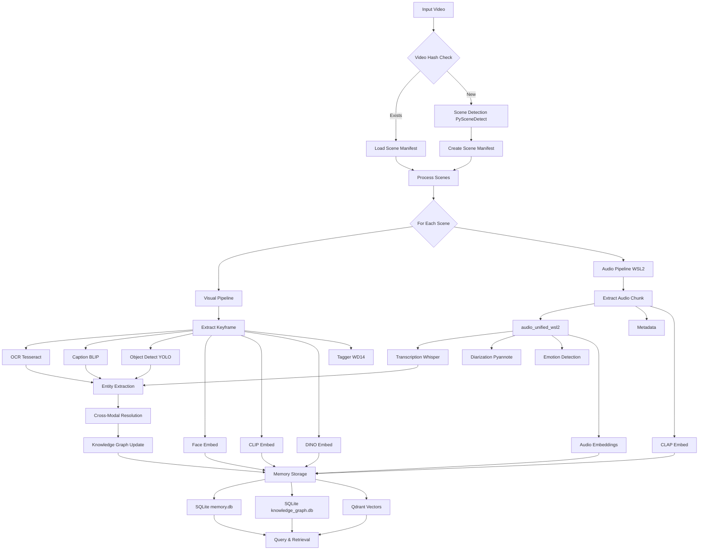
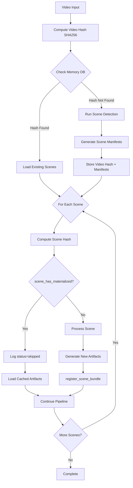
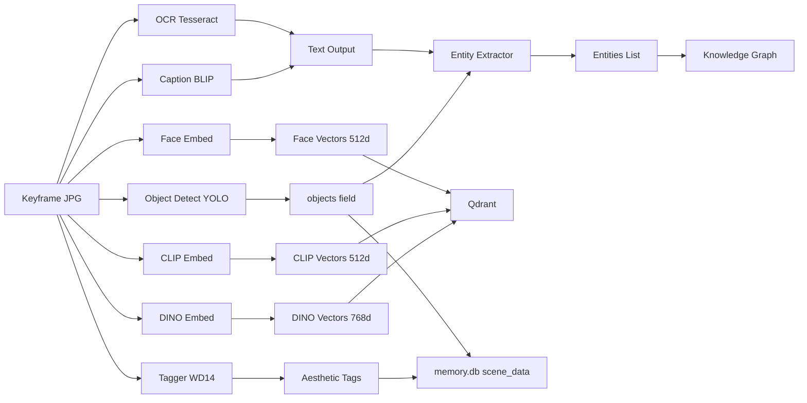
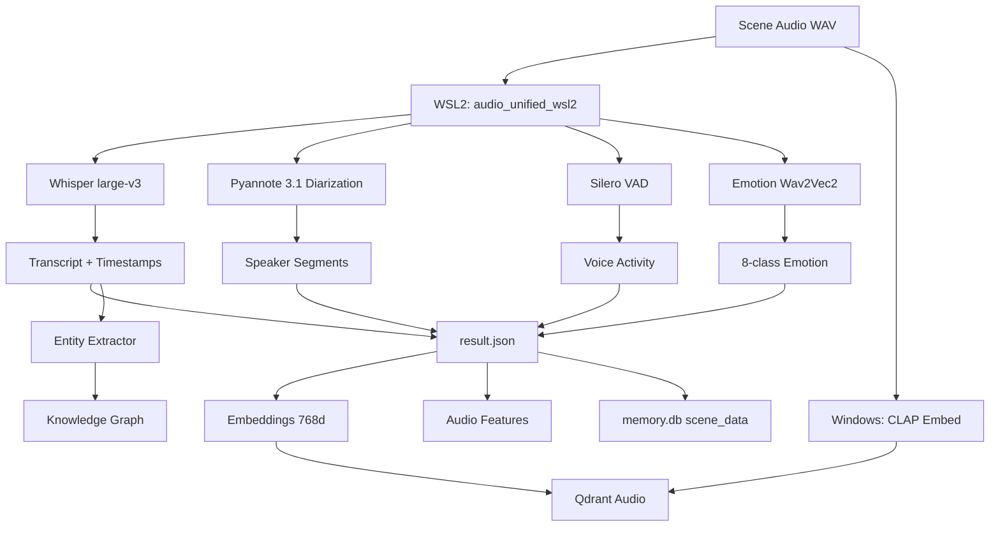
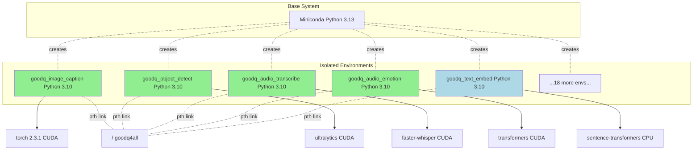
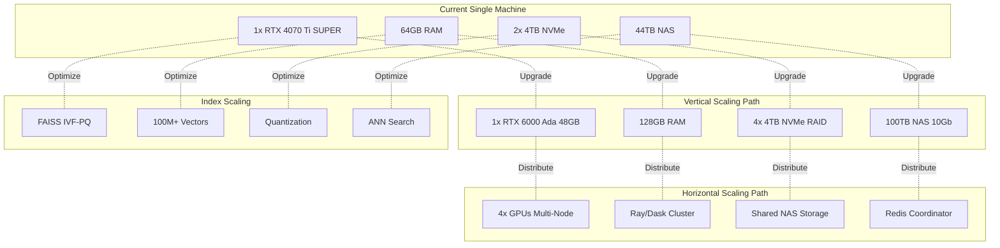
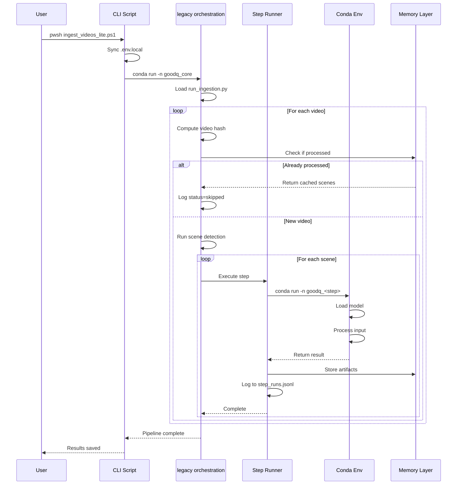
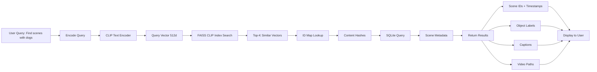

# GoodQ Pipeline Flow Diagrams

**Last Updated:** December 15, 2025  
**Status:** ✅ Production Verified

## 📊 Visual Architecture Reference

This document contains ASCII and Mermaid diagrams for the GoodQ pipeline architecture. View these diagrams in a Markdown-compatible viewer or use Mermaid Live Editor.

**Evidence Source:** Forensic code analysis of `cli/run_ingestion.py`, verified active processing logs (Dec 14-15, 2025)

---

## 🎬 Complete Pipeline Flow (Current Production)



---

## 🔄 Deduplication Flow



---

## 🖼️ Visual Pipeline Detail (Production)



**Artifact Locations (Verified Dec 15, 2025):**
- Keyframes: `<project_root>\logs\scene_ingest\<video_name>\video\scene_XXXX.jpg`
- Stored in: `memory.db` (scene_bundles table) + Qdrant collections

---

## 🎵 Audio Pipeline Detail (WSL2 Unified - Production)



**Artifact Locations (Verified Dec 15, 2025):**
- Audio chunks: `<project_root>\logs\scene_ingest\<video_name>\audio\scene_XXXX.wav`
- WSL2 output: `\\wsl.localhost\Ubuntu\home\joesdomingo\goodq_audio\output\result.json`
- GPU: RTX 4070 Ti SUPER 16GB, CUDA 12.8
- Models loaded: Whisper medium (service) / large-v3 (direct), Pyannote 3.1, Silero VAD, Wav2Vec2 emotion

---

## 💾 Memory Layer Architecture (Production)

```mermaid
graph TB
    subgraph "Persistent Storage"
        A[memory.db] --> A1[scenes table]
        A --> A2[assets table]
        A --> A3[scene_bundles table]
        A --> A4[video_metadata table]
        
        B[knowledge_graph.db] --> B1[entities table]
        B --> B2[relationships table]
        B --> B3[entity_mentions table]
        B --> B4[cross_references table]
        
        C[Qdrant Collections] --> C1[text_embeddings]
        C --> C2[clip_embeddings]
        C --> C3[dino_embeddings]
        C --> C4[audio_embeddings]
    end
    
    subgraph "Query Layer"
        D[Semantic Search] --> C1
        D --> C2
        D --> C3
        D --> C4
        
        E[Metadata Query] --> A1
        E --> A2
        E --> A3
        
        F[Graph Traversal] --> B1
        F --> B2
        F --> B3
        
        G[Cross-Modal] --> A
        G --> B
        G --> C
    end
    
    C1 -.payload.scene_id.- A1
    C2 -.payload.scene_id.- A1
    C3 -.payload.scene_id.- A1
    C4 -.payload.scene_id.- A1
    B3 -.scene_id.- A1
```

**Database Locations (Stitching-Era Baseline):**
- memory.db: `<GOODQ_DATA_ROOT>\GoodQ_Data\epochs\<epoch>\memory.db`
- knowledge_graph.db: `<GOODQ_DATA_ROOT>\GoodQ_Data\epochs\<epoch>\knowledge_graph.db`
- Qdrant: `localhost:6333` (Windows service, no Docker)
- Vector dimensions: text=384d, CLIP=512d, DINO=768d, audio=512d

---

## 🏗️ Environment Isolation



---

## ⚡ Performance: First Run vs Deduplication

```
First Run (158 seconds)
━━━━━━━━━━━━━━━━━━━━━━━━━━━━━━━━━━━━━━━━━━━━━━━━━━━━━━━━━━━
Scene Detection     ████████████ 12s
Image OCR           ██████ 6s (x2 scenes)
Image Caption       ███████████████ 14s (x2 scenes)
Object Detection    ████████████ 12s (x2 scenes)
Face Embedding      ████████ 8s (x2 scenes)
CLIP Embedding      ██████████ 10s (x2 scenes)
DINO Embedding      ██████████ 10s (x2 scenes)
Audio Metadata      ████ 4s
Audio Diarization   ██████████████████ 18s
Audio Transcription █████████████████████████ 25s
Speech Emotion      ██████ 6s
CLAP Embedding      ██████████ 10s
Text Processing     ███████ 7s
NER Tagging         ████████ 8s
Memory Integration  ████████ 8s

Second Run (38 seconds - 76% faster!)
━━━━━━━━━━━━━━━━━━━━━━━━━━━━━━━━━━━━━━━━━━━━━━━━━━━━━━━━━━━
Scene Detection     (skipped - dedupe)
Image OCR           ███ 3s (partial)
Image Caption       ███████ 7s (partial)
Object Detection    ██████ 6s (partial)
Face Embedding      (skipped - dedupe)
CLIP Embedding      (skipped - dedupe)
DINO Embedding      (skipped - dedupe)
Audio Metadata      (skipped - dedupe)
Audio Diarization   (skipped - dedupe)
Audio Transcription (skipped - dedupe)
Speech Emotion      (skipped - dedupe)
CLAP Embedding      (skipped - dedupe)
Text Processing     ███ 3s (partial)
NER Tagging         ████ 4s (partial)
Memory Integration  ██████ 6s
```

---

## 🔐 Data Security Model

```mermaid
graph TD
    A[User Data] --> B{Privacy Boundary}
    
    B --> C[Local Processing Only]
    C --> D[GPU/CPU on <project_root> drive]
    
    B -.Optional.- E[External APIs]
    E -.User Choice.- F[OpenAI GPT]
    E -.User Choice.- G[ElevenLabs TTS]
    
    D --> H[Local Storage]
    H --> I[<GOODQ_DATA_ROOT>/GoodQ_Data (See LEGACY_PATHS_DEPRECATED.md)/]
    H --> J[<GOODQ_DATA_ROOT>/models/]
    
    I --> K[SQLite Encrypted?]
    I --> L[FAISS Indices]
    I --> M[Step Logs]
    
    K --> N[Backup to NAS]
    L --> N
    M --> N
    
    N --> O[<drive>:/ UGREEN NAS]
    O -.Optional.- P[GPG Encryption]
    
    style C fill:#90EE90
    style H fill:#90EE90
    style E fill:#FFD700
    style F fill:#FFD700
    style G fill:#FFD700
```

---

## 📊 Scalability Paths



---

## 🔄 Orchestration Flow



---

## 🎯 Use Case Flow: Video Search



---

## 📈 Monitoring Dashboard Components

```
┌─────────────────────────────────────────────────────────────────┐
│                    GoodQ Command Center                          │
├─────────────────────────────────────────────────────────────────┤
│                                                                  │
│  GPU Status                    System Metrics                   │
│  ┌──────────────────┐          ┌──────────────────┐            │
│  │ RTX 4070 Ti SUPER│          │ CPU: 34%         │            │
│  │ Temp: 67°C       │          │ RAM: 28GB/64GB   │            │
│  │ Usage: 85%       │          │ Disk: 1.2TB/4TB  │            │
│  │ Memory: 12GB/16GB│          │ Network: 2.5Gbps │            │
│  └──────────────────┘          └──────────────────┘            │
│                                                                  │
│  Pipeline Status               Recent Steps                     │
│  ┌──────────────────┐          ┌──────────────────┐            │
│  │ Running: Yes     │          │ image_caption OK │            │
│  │ Video: sample.mp4│          │ object_detect OK │            │
│  │ Scene: 5/12      │          │ audio_diarize OK │            │
│  │ Progress: 42%    │          │ audio_emotion OK │            │
│  └──────────────────┘          └──────────────────┘            │
│                                                                  │
│  Memory Stats                  Logs Tail                        │
│  ┌──────────────────┐          ┌──────────────────┐            │
│  │ Scenes: 1,234    │          │ [21:06:53] CLAP  │            │
│  │ Text Vecs: 45K   │          │ [21:06:46] tagger│            │
│  │ Image Vecs: 23K  │          │ [21:06:44] emotion│           │
│  │ Audio Vecs: 8.5K │          │ [21:06:40] merge │            │
│  │ DB Size: 892MB   │          │ [21:06:20] whisper│           │
│  └──────────────────┘          └──────────────────┘            │
│                                                                  │
└─────────────────────────────────────────────────────────────────┘
```

---

*Diagrams last updated: October 6, 2025*

**Note:** View these diagrams in:
- VS Code with Mermaid extension
- GitHub (native Mermaid rendering)
- [Mermaid Live Editor](https://mermaid.live)
- Any Markdown viewer with Mermaid support

