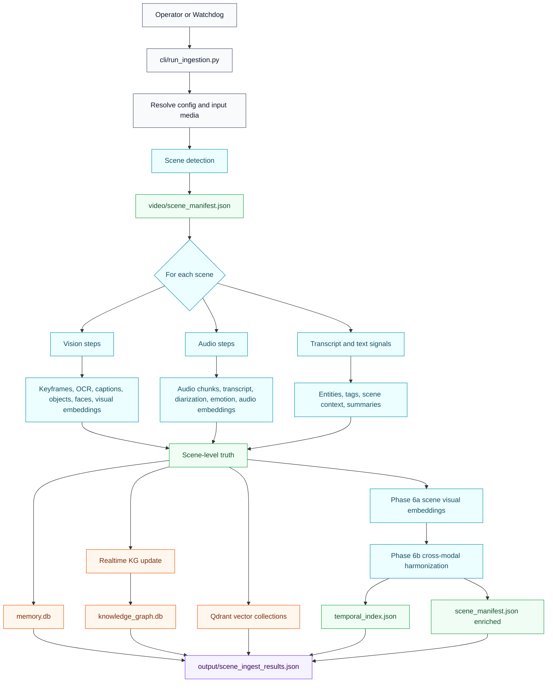
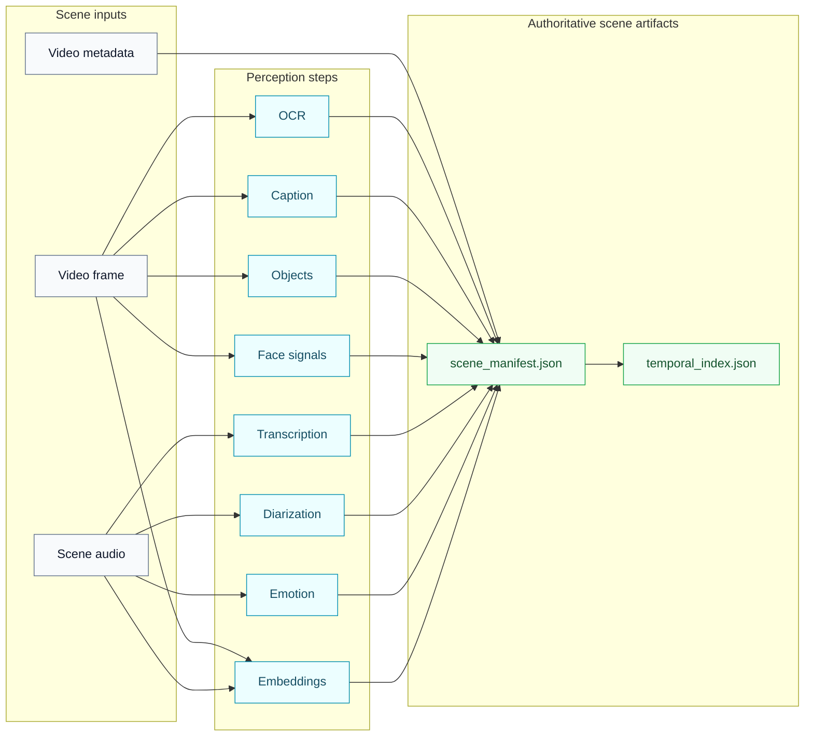
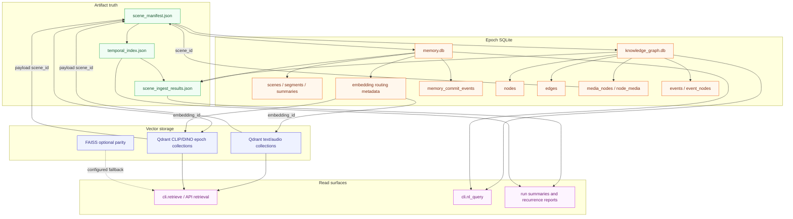
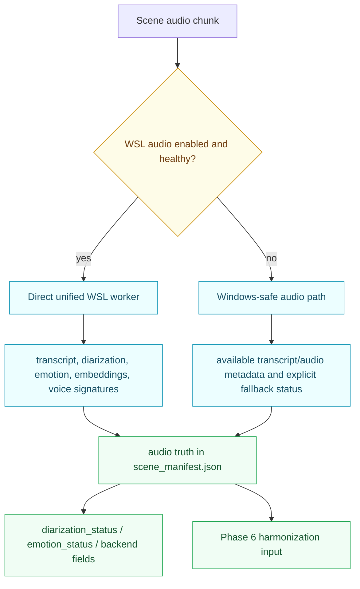
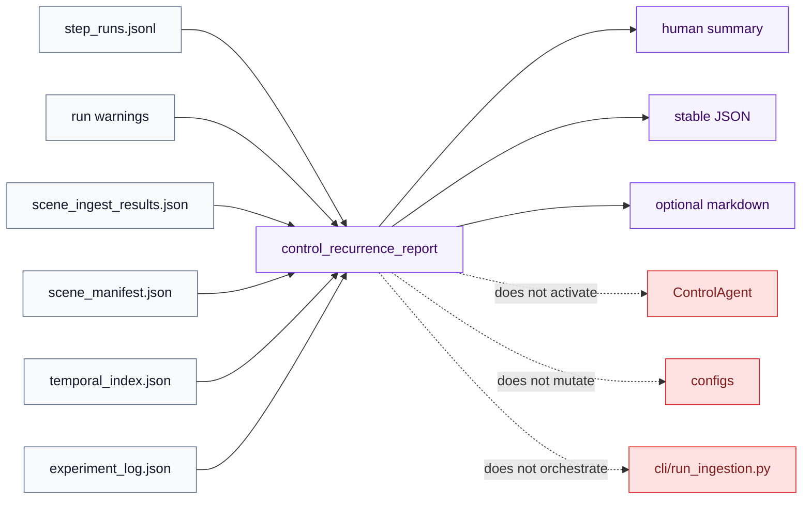
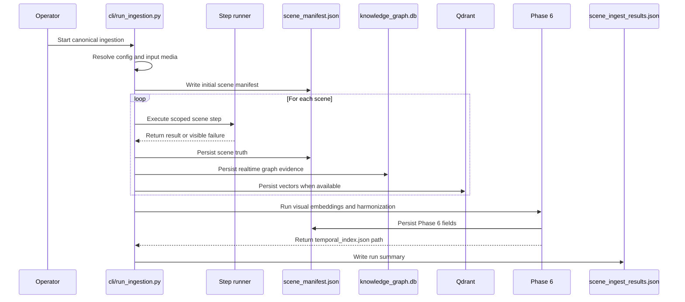
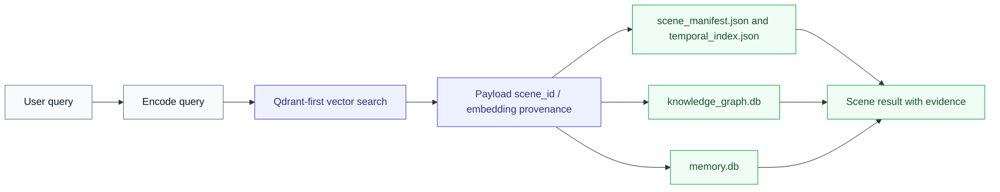

<!-- DOC_BADGE: CANONICAL -->
<!-- DOC_STATUS: AUTHORITATIVE -->
<!-- DOC_LAST_VERIFIED: 2026-04-27 -->

# GoodQ Pipeline Flow Diagrams

**Status:** Active architecture reference
**Rendering target:** GitHub Markdown with native Mermaid support

These diagrams describe the current GoodQ4All runtime shape. They are not a
replacement for the canonical contracts; they are a GitHub-friendly visual map
of those contracts.

Primary contracts:

- [INGEST_ORCHESTRATION_CONTRACT.md](../INGEST_ORCHESTRATION_CONTRACT.md)
- [SYSTEM_ARCHITECTURE.md](../SYSTEM_ARCHITECTURE.md)
- [MEMORY_STORAGE.md](../MEMORY_STORAGE.md)
- [SCENE_MANIFEST_SPECIFICATION.md](../SCENE_MANIFEST_SPECIFICATION.md)
- [PHASE6_MULTIMODAL_FUSION.md](../PHASE6_MULTIMODAL_FUSION.md)

The canonical execution owner remains `cli/run_ingestion.py`. Control recurrence
reporting is read-only observability and does not activate `ControlAgent` or
healing.

---

## Canonical Pipeline Flow

---

## Scene Truth Flow

---

## Memory Layer Architecture

This section replaces the older memory-layer diagram that did not render on
GitHub. The broken edge syntax has been replaced with conservative Mermaid
links, and the diagram now reflects the active epoch-scoped storage contract.

Storage locations:

- `memory.db`: `${GOODQ_DATA_ROOT}/GoodQ_Data/epochs/<epoch>/memory.db`
- `knowledge_graph.db`: `${GOODQ_DATA_ROOT}/GoodQ_Data/epochs/<epoch>/knowledge_graph.db`
- scene manifest: `${GOODQ_DATA_ROOT}/GoodQ_Data/epochs/<epoch>/processing/<video_name>/video/scene_manifest.json`
- temporal index: `${GOODQ_DATA_ROOT}/GoodQ_Data/epochs/<epoch>/processing/<video_name>/temporal_index.json`
- run summary: `${GOODQ_DATA_ROOT}/GoodQ_Data/epochs/<epoch>/output/scene_ingest_results.json`
- Qdrant: `http://127.0.0.1:6333`

Qdrant collection names are resolved from config. The active epoch pattern is
`goodq_<modality>_epoch_<epoch>` for configured modality collections.

---

## Audio Runtime Flow

WSL is a compute extension, not a storage authority. The Windows host and the
epoch artifact tree remain the source of truth.

---

## Control Observability Boundary

The recurrence report is observability only. It does not heal, mutate config, or
replace canonical ingestion.

---

## Orchestration Sequence

---

## Use Case Flow: Scene Retrieval

---

## Diagram Hygiene Notes

- Mermaid blocks intentionally use conservative `flowchart` and
  `sequenceDiagram` syntax for GitHub rendering.
- Scene manifests and `temporal_index.json` are authoritative artifact truth.
- Qdrant is the canonical vector store; FAISS is optional parity/fallback.
- Optional enrichment failures must remain visible and must not halt ingestion
  unless they invalidate the required scene/run truth.
