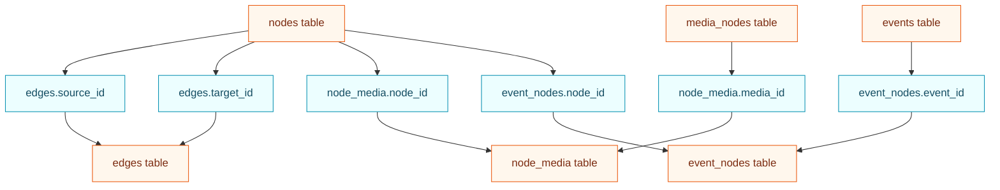
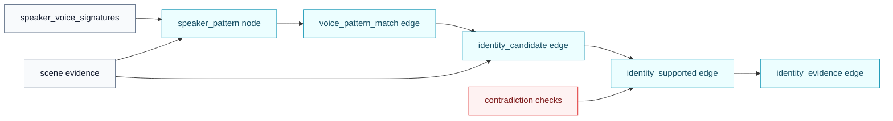
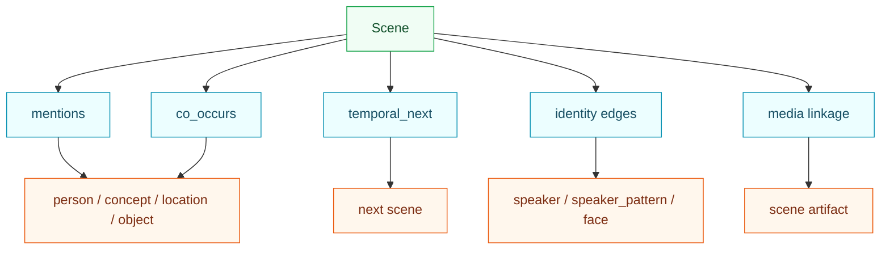

<!-- DOC_BADGE: CANONICAL -->
<!-- DOC_STATUS: AUTHORITATIVE -->
<!-- DOC_LAST_VERIFIED: 2026-04-27 -->

# Knowledge Graph Architecture

**Status:** Active architecture reference
**Rendering target:** GitHub Markdown with native Mermaid support

GoodQ4All's knowledge graph is an epoch-scoped SQLite-backed evidence graph. It
does not replace scene artifacts. It links scene-level perception, structural
speaker/face evidence, identity formation, temporal events, and retrieval
context back to persisted scene truth.

Primary contracts:

- [MEMORY_STORAGE.md](../MEMORY_STORAGE.md)
- [IDENTITY_STITCHING_CONTRACT.md](../IDENTITY_STITCHING_CONTRACT.md)
- [SCENE_MANIFEST_SPECIFICATION.md](../SCENE_MANIFEST_SPECIFICATION.md)
- [SYSTEM_ARCHITECTURE.md](../SYSTEM_ARCHITECTURE.md)

---

## Graph In The Runtime

```mermaid
flowchart TB
    SM["scene_manifest.json"] --> EXTRACT["Scene evidence extraction"]
    TI["temporal_index.json"] --> ROLLUP["Temporal rollups"]

    EXTRACT --> ENTITY["Entities and concepts"]
    EXTRACT --> SPEAKER["Speaker and voice patterns"]
    EXTRACT --> FACE["Face signals"]
    EXTRACT --> MEDIA["Media nodes"]
    ROLLUP --> EVENTS["Temporal events"]

    ENTITY --> KG["knowledge_graph.db"]
    SPEAKER --> KG
    FACE --> KG
    MEDIA --> KG
    EVENTS --> KG

    KG --> RETRIEVAL["Retrieval and query context"]
    KG --> LEDGER["Identity ledger projections"]
    KG --> AUDIT["Operator audits"]

    classDef artifact fill:#f0fdf4,stroke:#16a34a,color:#14532d
    classDef process fill:#ecfeff,stroke:#0891b2,color:#164e63
    classDef graph fill:#fff7ed,stroke:#ea580c,color:#7c2d12
    classDef read fill:#f5f3ff,stroke:#7c3aed,color:#3b0764

    class SM,TI artifact
    class EXTRACT,ROLLUP,ENTITY,SPEAKER,FACE,MEDIA,EVENTS process
    class KG graph
    class RETRIEVAL,LEDGER,AUDIT read
```

---

## Active Schema Map



Core tables:

- `nodes`
- `edges`
- `media_nodes`
- `node_media`
- `events`
- `event_nodes`

---

## Identity Formation Ladder



Rules:

- anonymous speaker and face nodes remain structural first
- co-presence is not identity
- promotion requires repeated, contradiction-free evidence
- every supported identity edge must remain explainable from scene evidence

---

## Common Edge Families



Common node types:

- `person`
- `location`
- `object`
- `concept`
- `speaker`
- `face`
- `speaker_pattern`

Common relationship families:

- `mentions`
- `co_occurs`
- `temporal_next`
- `voice_pattern_match`
- `identity_candidate`
- `identity_supported`
- `identity_evidence`

---

## Query And Audit Flow

```mermaid
flowchart LR
    QUERY["Operator or API query"] --> KG["knowledge_graph.db"]
    KG --> NODES["node lookup"]
    KG --> EDGES["bounded edge traversal"]
    KG --> MEDIA["scene/media lookup"]

    NODES --> EVIDENCE["Evidence bundle"]
    EDGES --> EVIDENCE
    MEDIA --> ARTIFACTS["scene_manifest.json / temporal_index.json"]
    ARTIFACTS --> EVIDENCE

    EVIDENCE --> ANSWER["answer or audit finding"]

    classDef query fill:#f8fafc,stroke:#64748b,color:#0f172a
    classDef graph fill:#fff7ed,stroke:#ea580c,color:#7c2d12
    classDef truth fill:#f0fdf4,stroke:#16a34a,color:#14532d

    class QUERY query
    class KG,NODES,EDGES,MEDIA graph
    class ARTIFACTS,EVIDENCE,ANSWER truth
```

GoodQ graph reads should remain bounded and evidence-backed. The graph can
summarize relationships, but scene manifests and temporal indexes remain the
authoritative scene truth surfaces.
