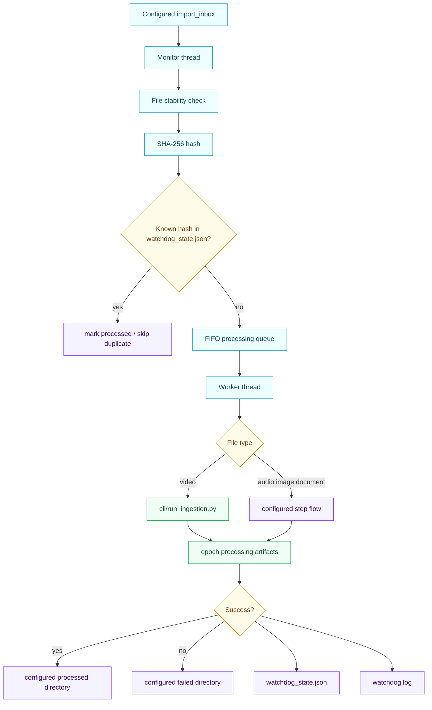
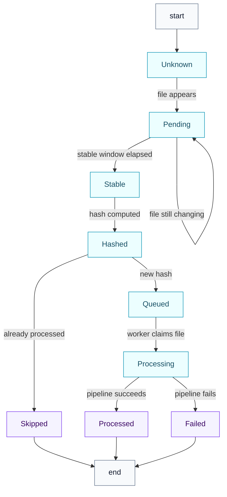
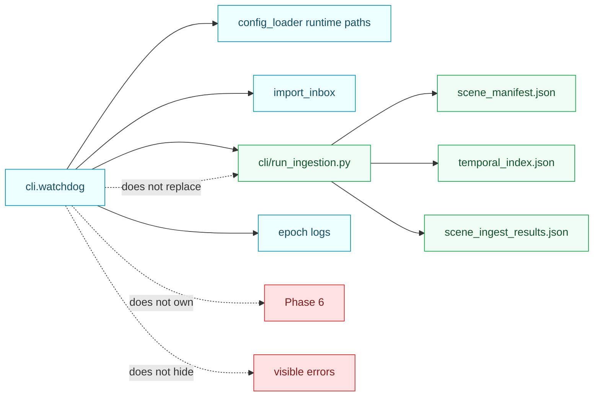

<!-- DOC_BADGE: CANONICAL -->
<!-- DOC_STATUS: AUTHORITATIVE -->
<!-- DOC_LAST_VERIFIED: 2026-04-27 -->

# Watchdog Flow Diagram

**Status:** Active architecture reference
**Rendering target:** GitHub Markdown with native Mermaid support

The Watchdog is the zero-touch ingestion monitor. It watches the configured
import inbox and delegates video ingestion to the canonical ingestion runtime.
It is not a second pipeline and does not make hidden runtime decisions outside
the resolved config surface.

Primary references:

- [WATCHDOG_SYSTEM.md](../../systems/WATCHDOG_SYSTEM.md)
- [WATCHDOG_GUIDE.md](../../guides/watchdog/WATCHDOG_GUIDE.md)
- [INGEST_ORCHESTRATION_CONTRACT.md](../INGEST_ORCHESTRATION_CONTRACT.md)

---

## Watchdog Runtime Flow

---

## State Machine

---

## Canonical Boundaries

Current path families are resolved from config and environment overlays:

- inbox: `${GOODQ_DATA_ROOT}/GoodQ_Data/import_inbox`
- processing: `${GOODQ_DATA_ROOT}/GoodQ_Data/epochs/<epoch>/processing`
- processed: `${GOODQ_DATA_ROOT}/GoodQ_Data/processed`
- failed: `${GOODQ_DATA_ROOT}/GoodQ_Data/failed`
- logs: `${GOODQ_DATA_ROOT}/GoodQ_Data/epochs/<epoch>/logs`

Control Agent state may be recorded by the runtime, but AI diagnosis remains
conditional on explicit `llm_client` injection. The read-only recurrence report
is a separate observer and does not enable healing.
