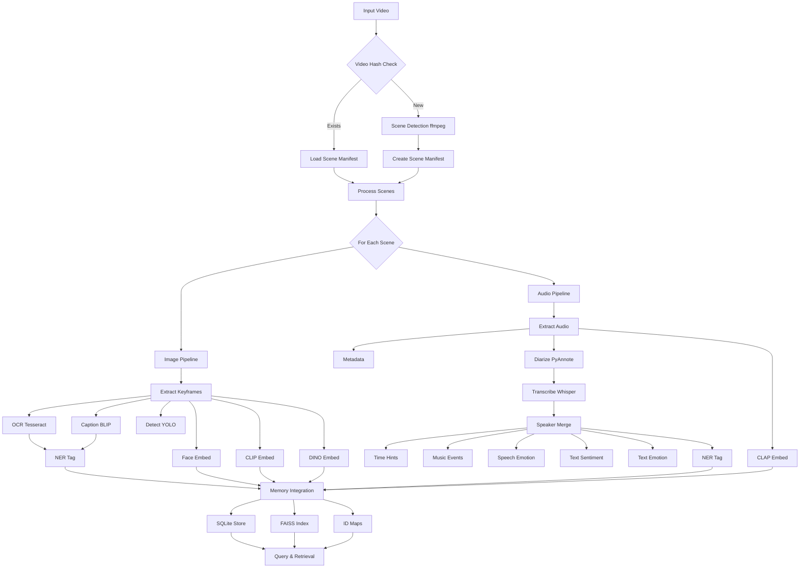
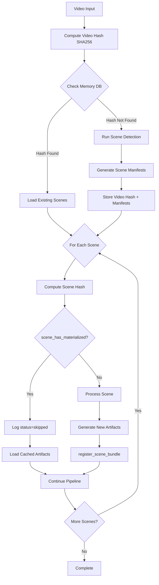
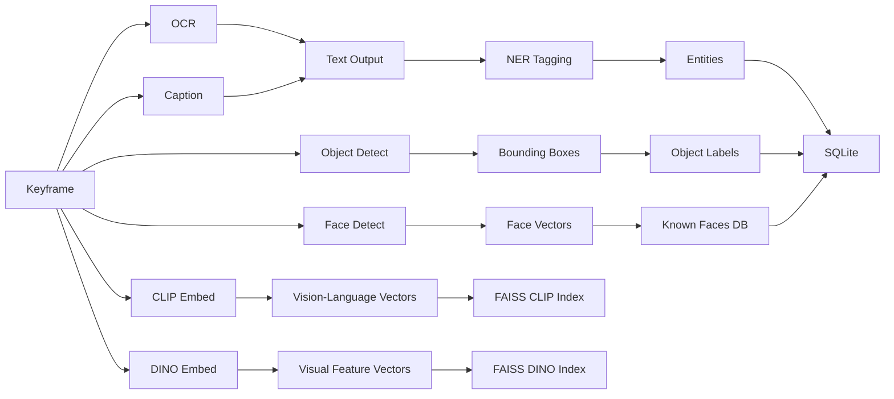
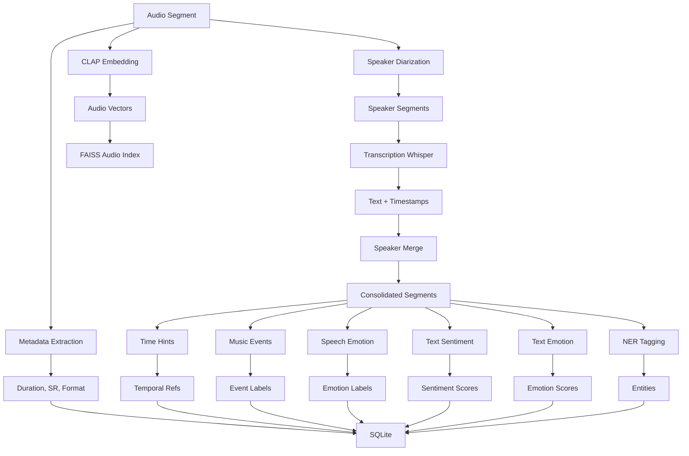
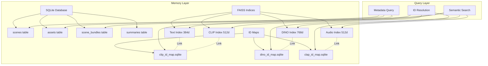
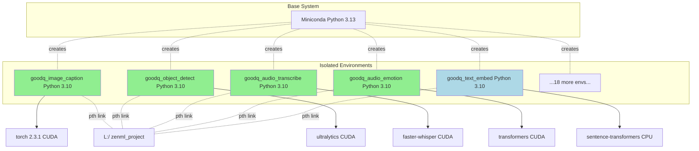
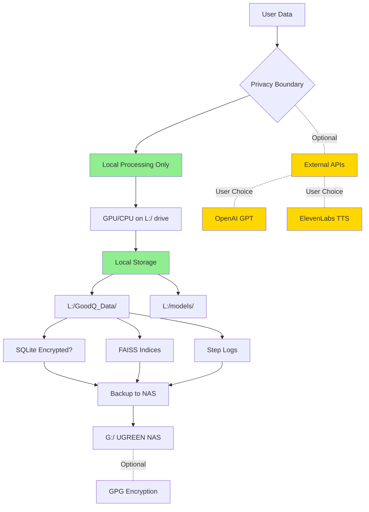
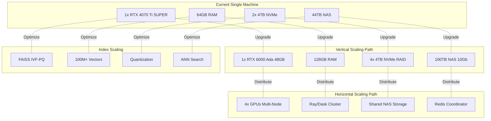
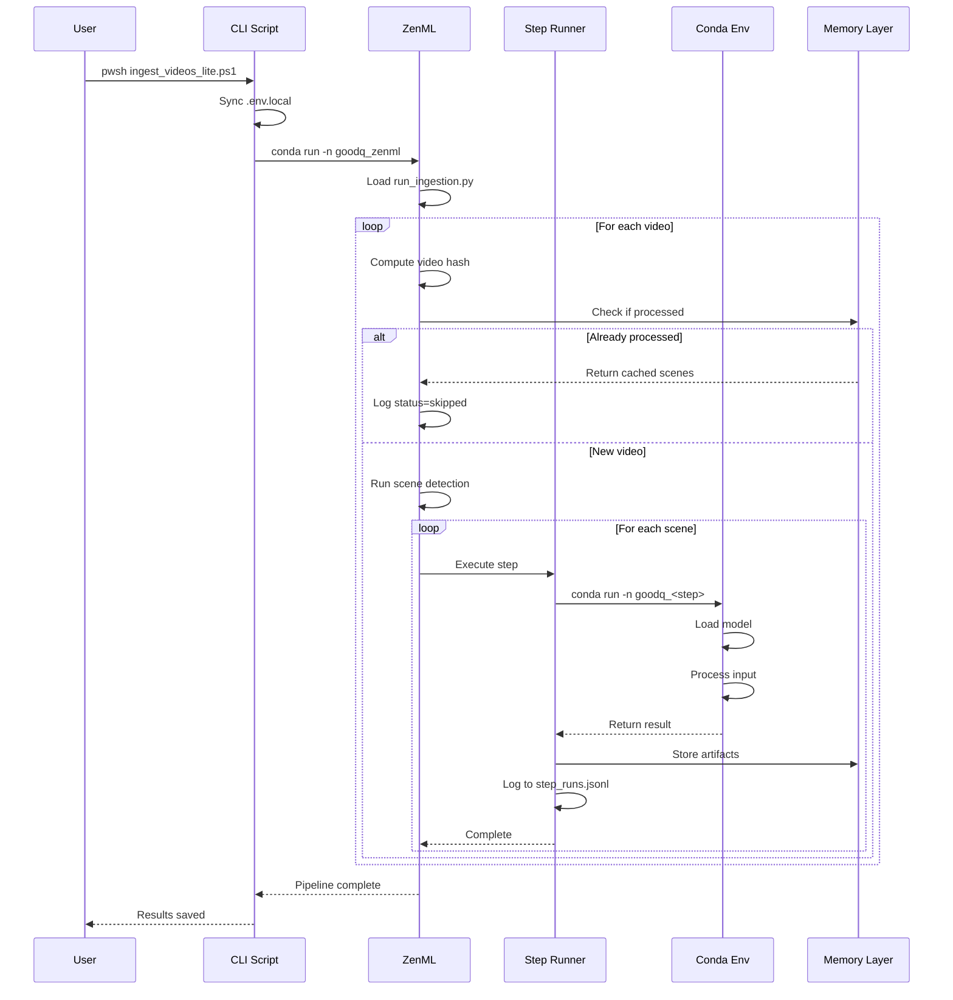
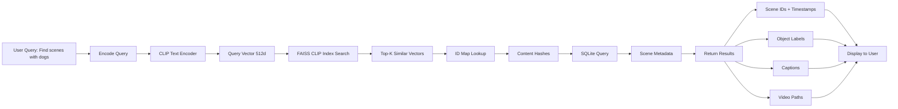

# GoodQ Pipeline Flow Diagrams

## 📊 Visual Architecture Reference

This document contains ASCII and Mermaid diagrams for the GoodQ pipeline architecture. View these diagrams in a Markdown-compatible viewer or use Mermaid Live Editor.

---

## 🎬 Complete Pipeline Flow



---

## 🔄 Deduplication Flow



---

## 🖼️ Image Pipeline Detail



---

## 🎵 Audio Pipeline Detail



---

## 💾 Memory Layer Architecture



---

## 🏗️ Environment Isolation



---

## ⚡ Performance: First Run vs Deduplication

```
First Run (158 seconds)
━━━━━━━━━━━━━━━━━━━━━━━━━━━━━━━━━━━━━━━━━━━━━━━━━━━━━━━━━━━
Scene Detection     ████████████ 12s
Image OCR           ██████ 6s (x2 scenes)
Image Caption       ███████████████ 14s (x2 scenes)
Object Detection    ████████████ 12s (x2 scenes)
Face Embedding      ████████ 8s (x2 scenes)
CLIP Embedding      ██████████ 10s (x2 scenes)
DINO Embedding      ██████████ 10s (x2 scenes)
Audio Metadata      ████ 4s
Audio Diarization   ██████████████████ 18s
Audio Transcription █████████████████████████ 25s
Speech Emotion      ██████ 6s
CLAP Embedding      ██████████ 10s
Text Processing     ███████ 7s
NER Tagging         ████████ 8s
Memory Integration  ████████ 8s

Second Run (38 seconds - 76% faster!)
━━━━━━━━━━━━━━━━━━━━━━━━━━━━━━━━━━━━━━━━━━━━━━━━━━━━━━━━━━━
Scene Detection     (skipped - dedupe)
Image OCR           ███ 3s (partial)
Image Caption       ███████ 7s (partial)
Object Detection    ██████ 6s (partial)
Face Embedding      (skipped - dedupe)
CLIP Embedding      (skipped - dedupe)
DINO Embedding      (skipped - dedupe)
Audio Metadata      (skipped - dedupe)
Audio Diarization   (skipped - dedupe)
Audio Transcription (skipped - dedupe)
Speech Emotion      (skipped - dedupe)
CLAP Embedding      (skipped - dedupe)
Text Processing     ███ 3s (partial)
NER Tagging         ████ 4s (partial)
Memory Integration  ██████ 6s
```

---

## 🔐 Data Security Model



---

## 📊 Scalability Paths



---

## 🔄 Orchestration Flow



---

## 🎯 Use Case Flow: Video Search



---

## 📈 Monitoring Dashboard Components

```
┌─────────────────────────────────────────────────────────────────┐
│                    GoodQ Command Center                          │
├─────────────────────────────────────────────────────────────────┤
│                                                                  │
│  GPU Status                    System Metrics                   │
│  ┌──────────────────┐          ┌──────────────────┐            │
│  │ RTX 4070 Ti SUPER│          │ CPU: 34%         │            │
│  │ Temp: 67°C       │          │ RAM: 28GB/64GB   │            │
│  │ Usage: 85%       │          │ Disk: 1.2TB/4TB  │            │
│  │ Memory: 12GB/16GB│          │ Network: 2.5Gbps │            │
│  └──────────────────┘          └──────────────────┘            │
│                                                                  │
│  Pipeline Status               Recent Steps                     │
│  ┌──────────────────┐          ┌──────────────────┐            │
│  │ Running: Yes     │          │ image_caption OK │            │
│  │ Video: sample.mp4│          │ object_detect OK │            │
│  │ Scene: 5/12      │          │ audio_diarize OK │            │
│  │ Progress: 42%    │          │ audio_emotion OK │            │
│  └──────────────────┘          └──────────────────┘            │
│                                                                  │
│  Memory Stats                  Logs Tail                        │
│  ┌──────────────────┐          ┌──────────────────┐            │
│  │ Scenes: 1,234    │          │ [21:06:53] CLAP  │            │
│  │ Text Vecs: 45K   │          │ [21:06:46] tagger│            │
│  │ Image Vecs: 23K  │          │ [21:06:44] emotion│           │
│  │ Audio Vecs: 8.5K │          │ [21:06:40] merge │            │
│  │ DB Size: 892MB   │          │ [21:06:20] whisper│           │
│  └──────────────────┘          └──────────────────┘            │
│                                                                  │
└─────────────────────────────────────────────────────────────────┘
```

---

*Diagrams last updated: October 6, 2025*

**Note:** View these diagrams in:
- VS Code with Mermaid extension
- GitHub (native Mermaid rendering)
- [Mermaid Live Editor](https://mermaid.live)
- Any Markdown viewer with Mermaid support
